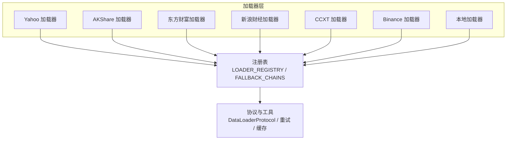
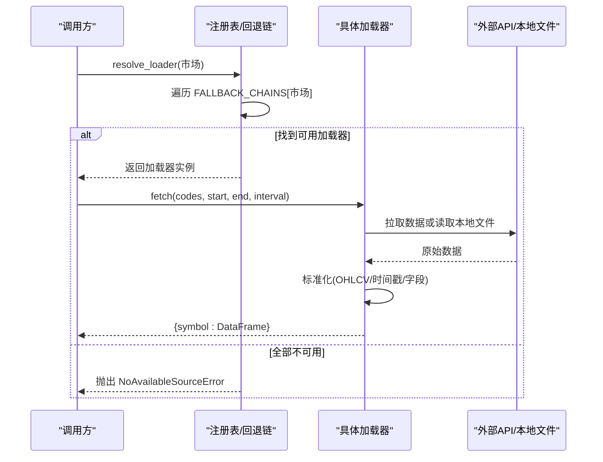
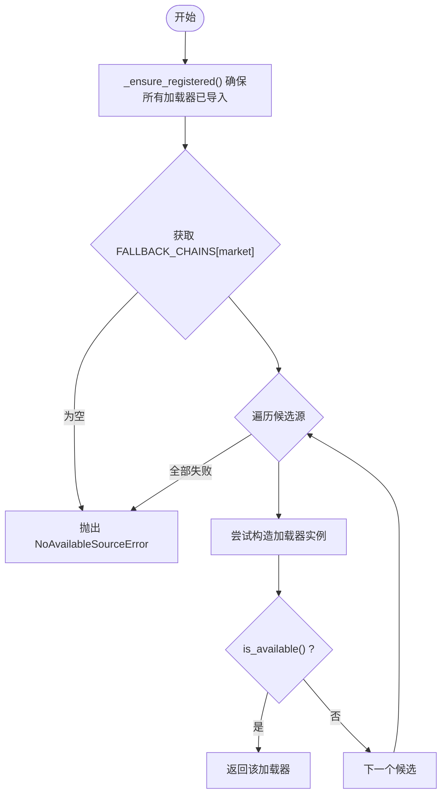
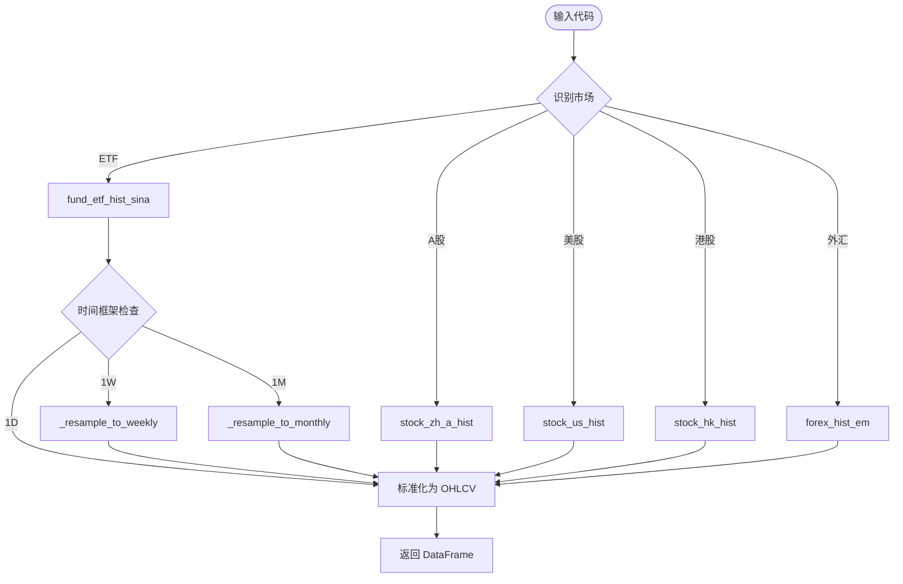
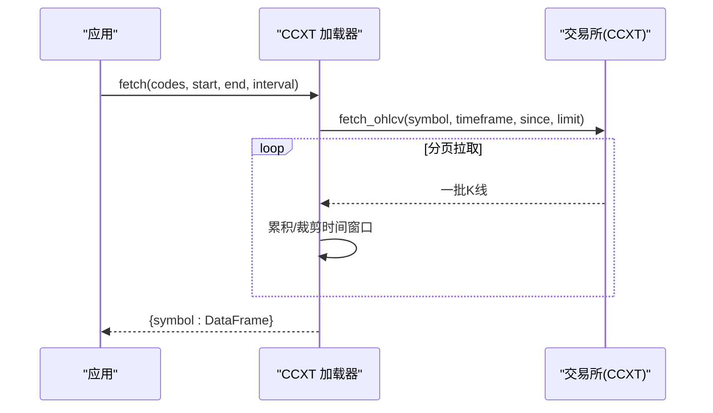
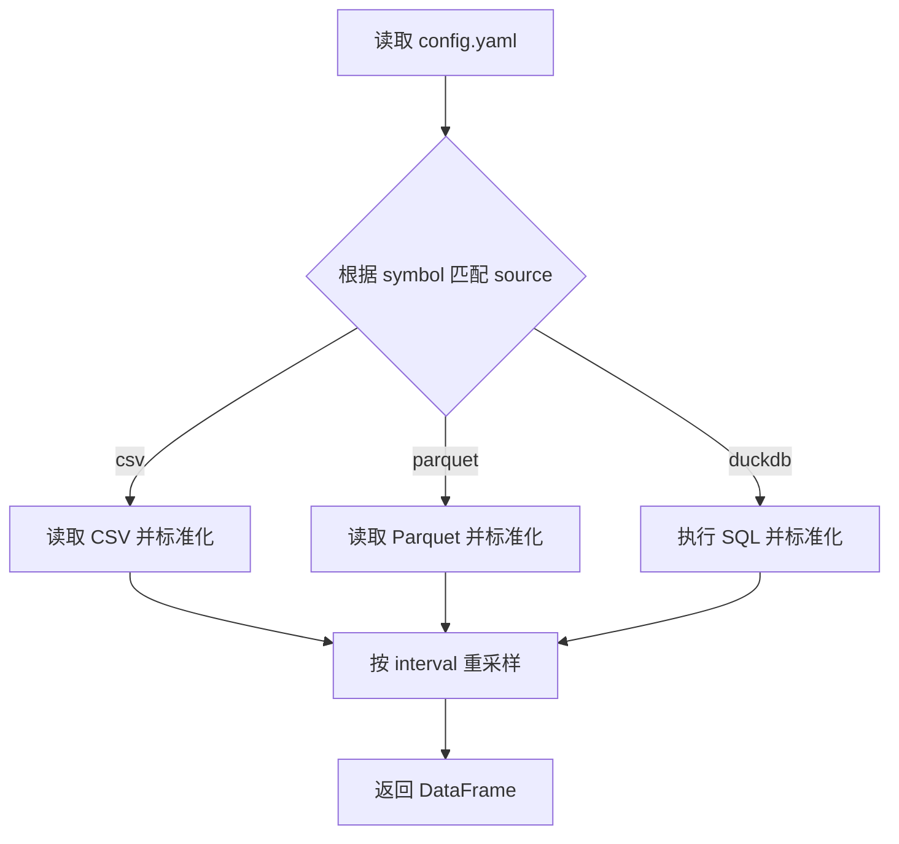
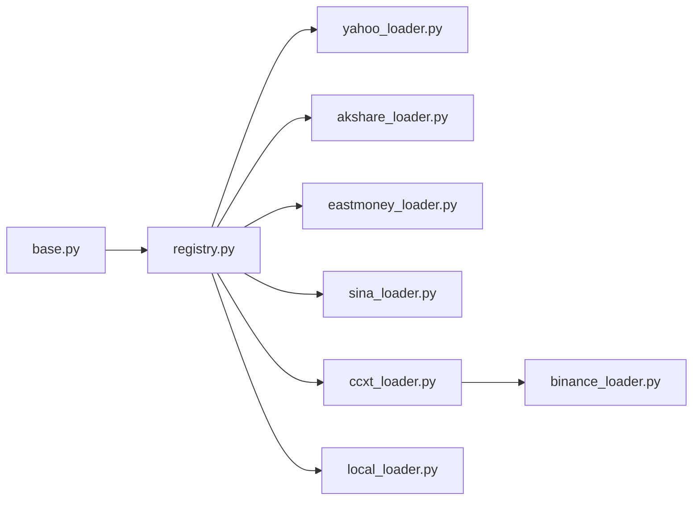

# 数据源集成架构

<cite>
**本文引用的文件**
- [registry.py](file://agent/backtest/loaders/registry.py)
- [base.py](file://agent/backtest/loaders/base.py)
- [yahoo_loader.py](file://agent/backtest/loaders/yahoo_loader.py)
- [binance_loader.py](file://agent/backtest/loaders/binance_loader.py)
- [ccxt_loader.py](file://agent/backtest/loaders/ccxt_loader.py)
- [akshare_loader.py](file://agent/backtest/loaders/akshare_loader.py)
- [local_loader.py](file://agent/backtest/loaders/local_loader.py)
- [eastmoney_loader.py](file://agent/backtest/loaders/eastmoney_loader.py)
- [sina_loader.py](file://agent/backtest/loaders/sina_loader.py)
- [_symbol_utils.py](file://agent/backtest/loaders/_symbol_utils.py)
- [test_registry.py](file://agent/tests/test_registry.py)
- [test_yahoo_loader.py](file://agent/tests/test_yahoo_loader.py)
- [test_akshare_loader.py](file://agent/tests/test_akshare_loader.py)
- [test_akshare_interval_reject.py](file://agent/tests/test_akshare_interval_reject.py)
- [test_akshare_daily_aliases.py](file://agent/tests/test_akshare_daily_aliases.py)
</cite>

## 更新摘要
**变更内容**
- 增强了AKShare加载器的ETF数据获取功能，改进了周度和月度时间框架的重采样处理
- 修复了关键bug：ETF数据虽然被获取，但未能正确使用_resample_to_weekly和_resample_to_monthly辅助方法转换为更高时间框架
- 完善了ETF符号识别逻辑，确保518880.SH等ETF代码正确路由到专用端点而非A股端点
- 优化了外汇对识别机制，避免EURUSD等外汇符号被错误地作为A股处理

## 目录
1. [简介](#简介)
2. [项目结构](#项目结构)
3. [核心组件](#核心组件)
4. [架构总览](#架构总览)
5. [详细组件分析](#详细组件分析)
6. [依赖关系分析](#依赖关系分析)
7. [性能考量](#性能考量)
8. [故障排查指南](#故障排查指南)
9. [结论](#结论)
10. [附录](#附录)

## 简介
本文件系统性说明 Vibe-Trading 的数据源集成架构，重点覆盖：
- 18+ 数据源的统一接入机制：注册表、市场类型映射与自动回退链。
- 各数据源特性对比（A股、美股、港股、加密货币等）、配置方法与认证流程。
- 数据格式标准化过程：OHLCV 数据结构、时间戳处理与货币单位转换。
- 自定义数据源开发指南：基类继承、接口实现与测试要求。
- 实际使用示例：查询不同市场数据与异常处理。

**更新** 针对AKShare加载器进行了重要改进，现在ETF数据能够正确处理周度和月度时间框架的重采样，解决了之前ETF数据获取后无法正确转换为更高时间框架的关键问题。

## 项目结构
数据加载器位于 backtest/loaders 目录，采用"协议 + 注册表 + 回退链"的解耦设计：
- base.py 定义 DataLoaderProtocol 协议、通用校验与重试/预算工具、本地缓存。
- registry.py 维护全局注册表 LOADER_REGISTRY、市场到回退链的映射 FALLBACK_CHAINS、以及 resolve_loader/get_loader_cls_with_fallback 等调度函数。
- 具体 loader 通过 @register 装饰器自注册，声明 name/markets/requires_auth，并实现 is_available/fetch。
- 测试覆盖注册表行为与关键 loader 的行为契约。



**图表来源**
- [registry.py:23-155](file://agent/backtest/loaders/registry.py#L23-L155)
- [base.py:618-645](file://agent/backtest/loaders/base.py#L618-L645)

**章节来源**
- [registry.py:1-252](file://agent/backtest/loaders/registry.py#L1-L252)
- [base.py:1-645](file://agent/backtest/loaders/base.py#L1-L645)

## 核心组件
- 数据加载器协议与异常
  - DataLoaderProtocol：统一 name/markets/requires_auth/is_available/fetch 接口。
  - NoAvailableSourceError：无可用数据源时抛出。
  - validate_date_range/validate_ohlc：日期区间与 OHLC 不变量校验。
- 注册表与回退链
  - LOADER_REGISTRY：name -> Loader 类的映射。
  - VALID_SOURCES：允许的配置来源集合，含 auto。
  - FALLBACK_CHAINS：按市场类型定义优先顺序，兼顾 IP 封禁风险与数据质量。**已优化** 针对中国大陆地区访问，将国内数据源置于 yfinance 之前。
  - resolve_loader(market)：按回退链返回首个可用的加载器实例。
  - get_loader_cls_with_fallback(source)：按 source 解析并支持同市场回退；对 local/qveris 禁止静默降级为网络源。
- 通用工具
  - 重试与预算：retry_with_budget/check_budget，限制瞬态错误重试次数与超时预算。
  - 本地缓存：loader_cache_* 系列函数，基于内容寻址的 parquet 缓存，避免重复拉取。

**章节来源**
- [base.py:27-119](file://agent/backtest/loaders/base.py#L27-L119)
- [base.py:163-236](file://agent/backtest/loaders/base.py#L163-L236)
- [base.py:243-439](file://agent/backtest/loaders/base.py#L243-L439)
- [base.py:618-645](file://agent/backtest/loaders/base.py#L618-L645)
- [registry.py:23-155](file://agent/backtest/loaders/registry.py#L23-L155)
- [registry.py:158-252](file://agent/backtest/loaders/registry.py#L158-L252)

## 架构总览
下图展示从调用方到具体数据源的请求流，包含市场路由、回退链选择、加载器执行与标准化输出。



**图表来源**
- [registry.py:158-193](file://agent/backtest/loaders/registry.py#L158-L193)
- [base.py:618-645](file://agent/backtest/loaders/base.py#L618-L645)

## 详细组件分析

### 注册表与市场回退链
- 注册机制：每个 loader 模块在导入时通过 @register 将自身加入 LOADER_REGISTRY。
- 市场映射：**已优化** FALLBACK_CHAINS 为每个市场定义有序候选源，特别针对中国大陆地区访问进行了优先级调整：
  - a_share: tencent → mootdx → eastmoney → baostock → akshare → tushare → local
  - us_equity: yahoo → eastmoney → akshare → sina → stooq → tiingo → fmp → finnhub → alphavantage → longbridge → local → yfinance
  - hk_equity: tencent → eastmoney → akshare → yahoo → futu → sina → stooq → tushare → longbridge → local → yfinance
  - crypto: okx → binance → ccxt → yfinance → local
  - forex: mt5 → akshare → yfinance → local
- 解析策略：
  - resolve_loader(market)：按链顺序尝试构造并 is_available()，失败则继续下一个。
  - get_loader_cls_with_fallback(source)：若指定 source 不可用，先检查是否属于 _NO_NETWORK_FALLBACK_SOURCES（如 local），若是则直接报错；否则尝试同市场回退。

**更新** 美股回退链中，东方财富、AKShare、新浪财经现在位于 yfinance 之前，解决了从中国大陆访问 Yahoo Finance 时的速率限制问题。港股回退链中，tencent 保持首位，akshare 在 yahoo 之前，yfinance 移至末尾作为最后备选。



**图表来源**
- [registry.py:71-114](file://agent/backtest/loaders/registry.py#L71-L114)
- [registry.py:158-193](file://agent/backtest/loaders/registry.py#L158-L193)

**章节来源**
- [registry.py:23-155](file://agent/backtest/loaders/registry.py#L23-L155)
- [registry.py:158-252](file://agent/backtest/loaders/registry.py#L158-L252)
- [test_registry.py:133-189](file://agent/tests/test_registry.py#L133-L189)

### AKShare 加载器（A股/美股/港股/期货/外汇/宏观）
- 特性：免费聚合数据，无需认证；覆盖 A 股、美股、港股、ETF、外汇、期货、基金、宏观。
- **重大更新** ETF数据处理功能增强：
  - 新增 `_resample_to_weekly` 和 `_resample_to_monthly` 辅助方法，用于将日线数据重采样为周线和月线
  - 修复了关键bug：之前ETF数据虽然被获取，但未能正确转换为更高时间框架
  - 改进了ETF符号识别逻辑，确保518880.SH等ETF代码正确路由到专用端点
- 区间限制：当前仅支持日频（1D/d/day/daily），但ETF数据支持周度和月度重采样。
- 标准化：统一中文/英文列名映射为 open/high/low/close/volume，trade_date 转 DatetimeIndex。
- **更新** 在中国大陆地区优先于 yfinance 使用，提供稳定的数据源支持。



**图表来源**
- [akshare_loader.py:201-225](file://agent/backtest/loaders/akshare_loader.py#L201-L225)
- [akshare_loader.py:304-335](file://agent/backtest/loaders/akshare_loader.py#L304-L335)

**章节来源**
- [akshare_loader.py:1-336](file://agent/backtest/loaders/akshare_loader.py#L1-L336)
- [test_akshare_loader.py:1-177](file://agent/tests/test_akshare_loader.py#L1-L177)
- [test_akshare_interval_reject.py:1-38](file://agent/tests/test_akshare_interval_reject.py#L1-L38)
- [test_akshare_daily_aliases.py:1-16](file://agent/tests/test_akshare_daily_aliases.py#L1-L16)

### Yahoo 加载器（美股/港股/加股/印股）
- 特性：免费 HTTP 直连，无需认证；支持 US/HK/India/Korea/Canada 等后缀符号；日频及分钟/小时级。
- 时间戳处理：Yahoo 日线以美东开盘时间戳返回，加载器将其归一化为 UTC 无时区午夜索引，保证与其他加载器的对齐。
- 区间映射：1D→1d，1H→1h，4H→1h（近似），1W→1wk，1M→1mo；分钟保持原样。
- 数据标准化：统一 open/high/low/close/volume，缺失列填充默认值，剔除无效 K 线。
- **更新** 在中国大陆地区访问时可能遇到速率限制，现已通过回退链优化减少影响。

```mermaid
classDiagram
class DataLoader {
+string name
+set markets
+bool requires_auth
+is_available() bool
+fetch(codes, start_date, end_date, interval, fields) dict
}
class YahooLoader {
+name = "yahoo"
+markets = {"us_equity","hk_equity","india_equity","kr_equity","ca_equity"}
+requires_auth = False
+is_available() True
+fetch(...)
-_to_yahoo_interval(interval)
-_rows_to_frame(rows, start, end, interval)
}
DataLoader <|-- YahooLoader
```

**图表来源**
- [base.py:618-645](file://agent/backtest/loaders/base.py#L618-L645)
- [yahoo_loader.py:173-271](file://agent/backtest/loaders/yahoo_loader.py#L173-L271)

**章节来源**
- [yahoo_loader.py:1-271](file://agent/backtest/loaders/yahoo_loader.py#L1-L271)
- [test_yahoo_loader.py:56-107](file://agent/tests/test_yahoo_loader.py#L56-L107)
- [test_yahoo_loader.py:130-176](file://agent/tests/test_yahoo_loader.py#L130-L176)
- [test_yahoo_loader.py:188-320](file://agent/tests/test_yahoo_loader.py#L188-L320)

### 东方财富加载器（A股/美股/港股）
- 特性：免费聚合数据，无需认证；覆盖 A 股、美股、港股；通过共享客户端进行速率限制管理。
- 符号路由：支持 A-share（600519.SH/000001.SZ）、Hong Kong（00700.HK）、US（AAPL.US）。
- 数据标准化：统一中文/英文列名映射为 open/high/low/close/volume，trade_date 转 DatetimeIndex。
- **更新** 在中国大陆地区优先于 yfinance 使用，提高访问稳定性。

**章节来源**
- [eastmoney_loader.py:1-177](file://agent/backtest/loaders/eastmoney_loader.py#L1-L177)

### 新浪财经加载器（美股）
- 特性：免费 JSONP API，无需认证；专门用于美股日线数据。
- 数据格式：JSONP 包装的 JSON 数组，包含 {d,o,h,l,c,v} 格式的 K 线数据。
- 速率限制：通过共享客户端进行每主机速率限制管理。
- **更新** 在中国大陆地区优先于 yfinance 使用，提供可靠的美股数据源。

**章节来源**
- [sina_loader.py:1-201](file://agent/backtest/loaders/sina_loader.py#L1-L201)

### Binance 专用加载器（加密货币）
- 特性：基于 CCXT 的 Binance 现货与 USD-M 永续合约；公开行情无需 API Key。
- 与 CCXT 的关系：继承 CCXT 加载器，固定交易所为 Binance/BinanceUSD-M，复用其重试/预算与代理配置。

```mermaid
classDiagram
class CcxtDataLoader {
+name = "ccxt"
+markets = {"crypto"}
+requires_auth = False
+fetch(...)
-_get_exchange(instrument_type)
}
class BinanceLoader {
+name = "binance"
+markets = {"crypto"}
+requires_auth = False
-_get_exchange(instrument_type)
}
CcxtDataLoader <|-- BinanceLoader
```

**图表来源**
- [ccxt_loader.py:184-224](file://agent/backtest/loaders/ccxt_loader.py#L184-L224)
- [binance_loader.py:23-45](file://agent/backtest/loaders/binance_loader.py#L23-L45)

**章节来源**
- [binance_loader.py:1-45](file://agent/backtest/loaders/binance_loader.py#L1-L45)
- [ccxt_loader.py:1-502](file://agent/backtest/loaders/ccxt_loader.py#L1-L502)

### CCXT 加载器（多交易所统一）
- 特性：通过 CCXT 统一访问 100+ 交易所；支持 spot 与 swap（-PERP）；内置分页、预算与重试。
- 永续合约：合并交易价格与标记价格 K 线，并附加资金费率结算信息；可选维护保证金层级（需外部提供 artifact）。
- 时间范围：毫秒时间戳转换为 trade_date，按 timeframe 容差校验完整性。



**图表来源**
- [ccxt_loader.py:226-308](file://agent/backtest/loaders/ccxt_loader.py#L226-L308)
- [ccxt_loader.py:426-502](file://agent/backtest/loaders/ccxt_loader.py#L426-L502)

**章节来源**
- [ccxt_loader.py:1-502](file://agent/backtest/loaders/ccxt_loader.py#L1-L502)

### 本地加载器（CSV/Parquet/DuckDB）
- 特性：从用户配置文件读取本地数据，支持 CSV、Parquet、DuckDB；可自定义列名与日期格式；支持重采样至目标区间。
- 配置位置：~/.vibe-trading/data-bridge/config.yaml。
- 标准化：统一列名、UTC 解析后转为无时区索引，校验 OHLC 不变量，补齐 volume。



**图表来源**
- [local_loader.py:129-216](file://agent/backtest/loaders/local_loader.py#L129-L216)
- [local_loader.py:219-354](file://agent/backtest/loaders/local_loader.py#L219-L354)

**章节来源**
- [local_loader.py:1-354](file://agent/backtest/loaders/local_loader.py#L1-L354)

## 依赖关系分析
- 耦合点
  - 所有 loader 均依赖 base 协议与工具（校验、重试、缓存）。
  - registry 集中管理市场到回退链的映射，解耦上层业务逻辑与具体数据源。
- 外部依赖
  - CCXT/Binance/Yahoo/AKShare/本地文件等外部资源仅在需要时引入，降低启动开销。
- 循环依赖
  - 通过延迟 import（如 ccxt、akshare）避免循环与冷启动成本。



**图表来源**
- [registry.py:71-114](file://agent/backtest/loaders/registry.py#L71-L114)
- [ccxt_loader.py:203-224](file://agent/backtest/loaders/ccxt_loader.py#L203-L224)
- [binance_loader.py:15-45](file://agent/backtest/loaders/binance_loader.py#L15-L45)

**章节来源**
- [registry.py:71-114](file://agent/backtest/loaders/registry.py#L71-L114)
- [ccxt_loader.py:203-224](file://agent/backtest/loaders/ccxt_loader.py#L203-L224)
- [binance_loader.py:15-45](file://agent/backtest/loaders/binance_loader.py#L15-L45)

## 性能考量
- 重试与预算
  - retry_with_budget 限制瞬态错误的重试次数与总耗时，防止长尾阻塞。
  - CCXT 加载器设置 CCXT_TIMEOUT_MS 与 CCXT_FETCH_BUDGET_S，保障批量拉取不超时。
- 本地缓存
  - 基于内容哈希的 parquet 缓存，命中后跳过网络请求；仅对已结算日期范围缓存。
- 时间戳与重采样
  - Yahoo 日线归一化午夜索引，避免跨源对齐问题；本地加载器支持重采样以满足不同粒度需求。
  - **更新** AKShare ETF数据现在支持高效的周度和月度重采样，减少了网络请求次数。
- **更新** 回退链优化减少了中国大陆地区的网络请求失败率，提高了整体性能。

**章节来源**
- [base.py:163-236](file://agent/backtest/loaders/base.py#L163-L236)
- [base.py:243-439](file://agent/backtest/loaders/base.py#L243-L439)
- [ccxt_loader.py:50-57](file://agent/backtest/loaders/ccxt_loader.py#L50-L57)
- [yahoo_loader.py:125-170](file://agent/backtest/loaders/yahoo_loader.py#L125-L170)
- [local_loader.py:83-127](file://agent/backtest/loaders/local_loader.py#L83-L127)
- [akshare_loader.py:304-335](file://agent/backtest/loaders/akshare_loader.py#L304-L335)

## 故障排查指南
- 无可用数据源
  - 现象：resolve_loader 抛出 NoAvailableSourceError。
  - 排查：检查网络、API Token、本地 Data Bridge 配置；确认市场回退链中至少有一个可用。
- 初始化异常导致回退
  - 现象：某些加载器在 __init__ 中因缺少凭据抛错，应被回退链忽略。
  - 依据：注册表捕获构造异常并继续尝试下一个候选。
- 明确 local 请求不静默降级
  - 现象：显式请求 local 但不可用时，不会退化为网络源，提示检查 Data Bridge 配置。
- 数据校验失败
  - 现象：OHLC 不变量不满足（如 high < low、非正价格）。
  - 处理：validate_ohlc 会丢弃/警告/拒绝，视策略而定。
- **更新** AKShare ETF数据重采样问题
  - 现象：ETF数据获取后无法转换为周度或月度时间框架。
  - 解决方案：系统已修复此问题，现在ETF数据能够正确使用_resample_to_weekly和_resample_to_monthly方法进行重采样。
- **更新** 中国大陆地区访问问题
  - 现象：Yahoo Finance 访问受限或速率限制。
  - 解决方案：系统已自动优先使用国内数据源（东方财富、AKShare、新浪财经），如仍存在问题，建议检查网络连接或使用本地数据源。

**章节来源**
- [registry.py:158-193](file://agent/backtest/loaders/registry.py#L158-L193)
- [registry.py:221-252](file://agent/backtest/loaders/registry.py#L221-L252)
- [base.py:31-119](file://agent/backtest/loaders/base.py#L31-L119)
- [test_registry.py:226-337](file://agent/tests/test_registry.py#L226-L337)
- [akshare_loader.py:201-225](file://agent/backtest/loaders/akshare_loader.py#L201-L225)

## 结论
Vibe-Trading 的数据源集成通过"协议 + 注册表 + 回退链"实现了高内聚、低耦合的统一接入。各数据源遵循相同接口，屏蔽差异化的时间戳、列名与认证方式；回退链在保证可用性的同时，兼顾了网络稳定性与数据质量。**最新更新** 针对AKShare加载器进行了重要改进，现在ETF数据能够正确处理周度和月度时间框架的重采样，解决了之前ETF数据获取后无法正确转换为更高时间框架的关键问题。结合重试预算与本地缓存，系统在大规模回测与实时场景中具备鲁棒性与高性能。

## 附录

### 数据源特性对比（摘要）
- A 股
  - 推荐链：tencent → mootdx → eastmoney → baostock → akshare → tushare → local
  - 特点：多源冗余，公共源优先，本地兜底。
- 美股
  - 推荐链：yahoo → eastmoney → akshare → sina → stooq → tiingo → fmp → finnhub → alphavantage → longbridge → local → yfinance
  - 特点：**已优化** 国内数据源优先于 yfinance，解决中国大陆访问问题；免费公共源在前，付费 REST 在后。
- 港股
  - 推荐链：tencent → eastmoney → akshare → yahoo → futu → sina → stooq → tushare → longbridge → local → yfinance
  - 特点：**已优化** tencent 保持首位，akshare 在 yahoo 之前，考虑大陆 IP 限制，Yahoo SDK 可能受限。
- 加密货币
  - 推荐链：okx → binance → ccxt → yfinance → local
  - 特点：原生交易所优先，通用 CCXT 兜底。
- 外汇
  - 推荐链：mt5 → akshare → yfinance → local
  - 特点：本地终端优先，其次公共源。

**章节来源**
- [registry.py:136-158](file://agent/backtest/loaders/registry.py#L136-L158)

### 配置与认证要点
- 无需认证
  - Yahoo、AKShare、东方财富、新浪财经、CCXT（公开行情）、本地加载器（本地文件）。
- 需要认证
  - Tushare、Tiingo、FMP、Finnhub、AlphaVantage、Longbridge、Futu、MT5 等（由各自 loader 在 is_available 中判断）。
- 本地配置
  - 路径：~/.vibe-trading/data-bridge/config.yaml
  - 支持 csv/parquet/duckdb，可自定义列名与日期格式。

**章节来源**
- [base.py:618-645](file://agent/backtest/loaders/base.py#L618-L645)
- [local_loader.py:1-354](file://agent/backtest/loaders/local_loader.py#L1-L354)

### 数据格式标准化
- OHLCV 字段：open、high、low、close、volume；缺失列补零或 NA。
- 时间戳：统一为 trade_date（DatetimeIndex），日线归一化午夜；分钟/小时保留真实时间。
- 货币单位：各源返回数值型价格，加载器内部进行 to_numeric 转换与清洗。
- **更新** AKShare ETF数据现在支持周度和月度重采样，使用周五作为周线锚点，月末作为月线锚点。

**章节来源**
- [base.py:50-119](file://agent/backtest/loaders/base.py#L50-L119)
- [yahoo_loader.py:125-170](file://agent/backtest/loaders/yahoo_loader.py#L125-L170)
- [akshare_loader.py:259-292](file://agent/backtest/loaders/akshare_loader.py#L259-L292)
- [akshare_loader.py:304-335](file://agent/backtest/loaders/akshare_loader.py#L304-L335)
- [ccxt_loader.py:426-502](file://agent/backtest/loaders/ccxt_loader.py#L426-L502)

### 自定义数据源开发指南
- 步骤
  1) 新建 loader 模块，实现 DataLoaderProtocol（name/markets/requires_auth/is_available/fetch）。
  2) 使用 @register 装饰器自注册。
  3) 在 fetch 中使用 cached_loader_fetch 包装拉取逻辑，利用重试与缓存。
  4) 输出标准 OHLCV DataFrame，必要时调用 validate_ohlc。
- 测试要求
  - 验证 is_available 在不同环境下的行为。
  - 验证 fetch 对空输入、异常隔离、时间窗口裁剪、列名与类型标准化。
  - 若涉及网络，使用 mock 隔离外部依赖。

**章节来源**
- [base.py:618-645](file://agent/backtest/loaders/base.py#L618-L645)
- [registry.py:62-68](file://agent/backtest/loaders/registry.py#L62-L68)
- [test_yahoo_loader.py:229-320](file://agent/tests/test_yahoo_loader.py#L229-L320)

### 实际使用示例（描述性）
- 查询美股日线
  - 调用 resolve_loader("us_equity") 获取可用加载器（优先使用国内数据源如 eastmoney/akshare/sina），再 fetch(["AAPL.US"], "2024-01-01", "2024-01-31", interval="1D")。
- 查询港股日线
  - 调用 resolve_loader("hk_equity") 获取可用加载器（优先使用 tencent/eastmoney/akshare），再 fetch(["00700.HK"], "2024-01-01", "2024-01-31", interval="1D")。
- 查询ETF周线数据
  - **新增** 调用 resolve_loader("a_share") 获取AKShare加载器，再 fetch(["518880.SH"], "2024-01-01", "2024-12-31", interval="1W")，系统将自动使用_resample_to_weekly方法进行重采样。
- 查询ETF月线数据
  - **新增** 调用 resolve_loader("a_share") 获取AKShare加载器，再 fetch(["518880.SH"], "2024-01-01", "2024-12-31", interval="1M")，系统将自动使用_resample_to_monthly方法进行重采样。
- 查询加密货币永续合约
  - 使用 ccxt_loader.fetch(["BTC-USDT-PERP"], ...), 如需严格保证金风控，传入 bracket_artifacts 并设置 require_brackets=True。
- 查询本地数据
  - 配置 Data Bridge YAML，使用 local 加载器 fetch(["AAPL.US"], ...)，支持任意粒度并重采样。

**章节来源**
- [registry.py:158-193](file://agent/backtest/loaders/registry.py#L158-L193)
- [akshare_loader.py:201-225](file://agent/backtest/loaders/akshare_loader.py#L201-L225)
- [akshare_loader.py:304-335](file://agent/backtest/loaders/akshare_loader.py#L304-L335)
- [ccxt_loader.py:226-308](file://agent/backtest/loaders/ccxt_loader.py#L226-L308)
- [local_loader.py:249-354](file://agent/backtest/loaders/local_loader.py#L249-L354)