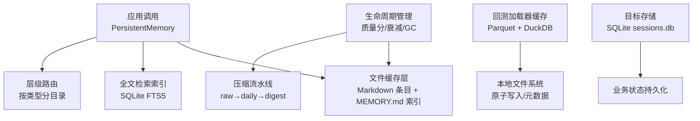
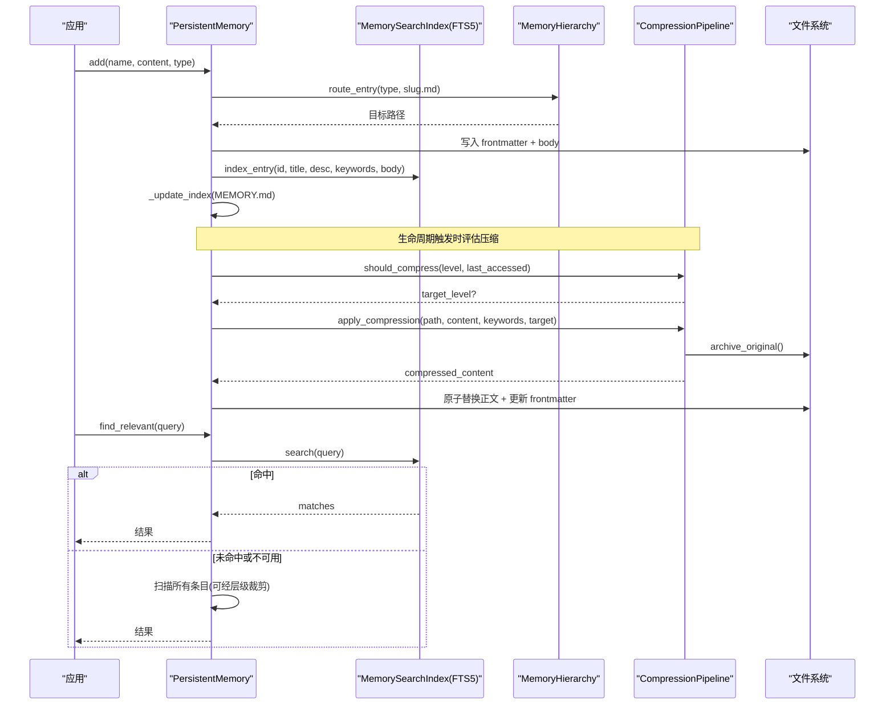
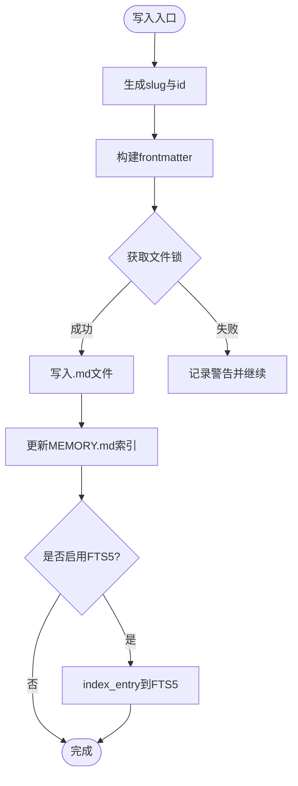
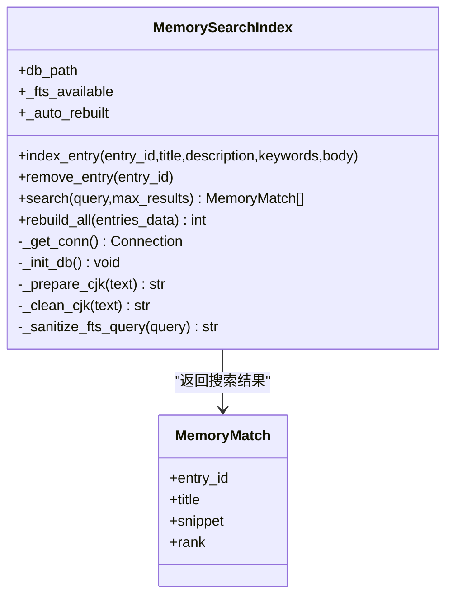
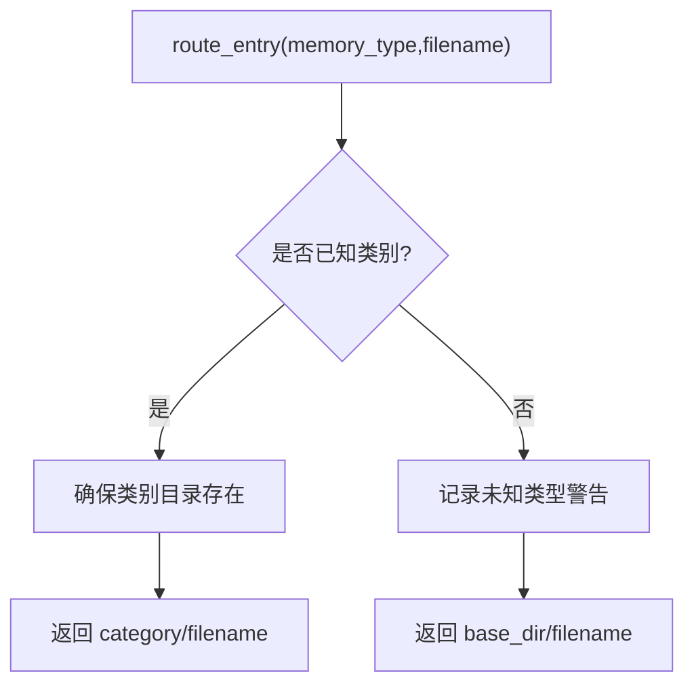
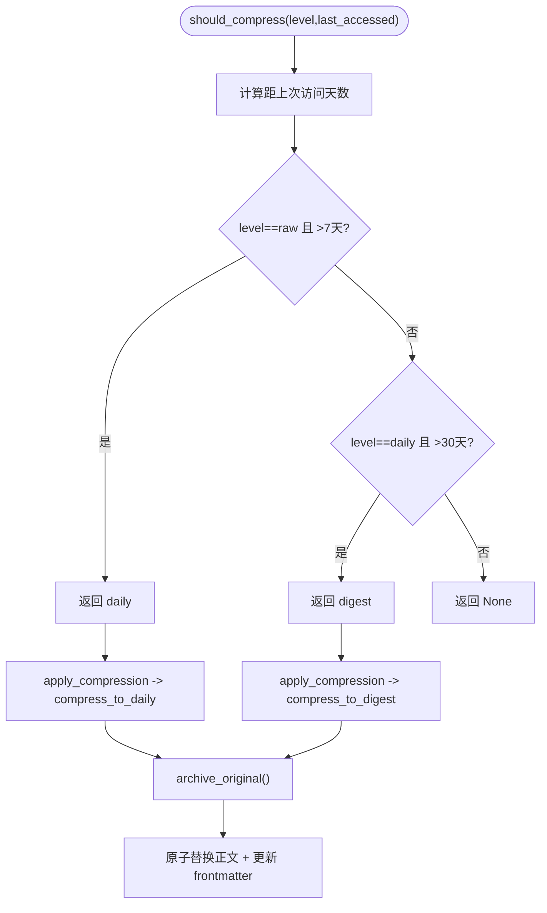
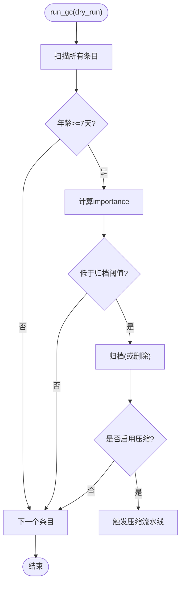
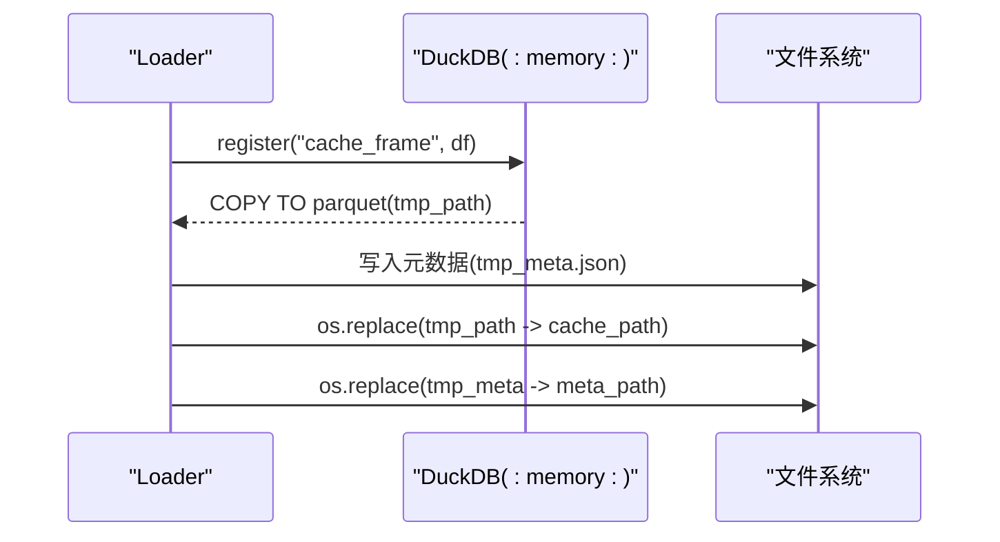
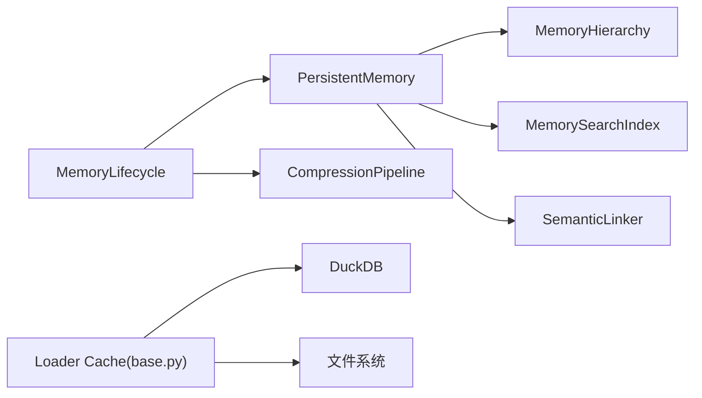

# 数据缓存系统

<cite>
**本文引用的文件**
- [persistent.py](file://agent/src/memory/persistent.py)
- [hierarchy.py](file://agent/src/memory/hierarchy.py)
- [compression.py](file://agent/src/memory/compression.py)
- [search_index.py](file://agent/src/memory/search_index.py)
- [lifecycle.py](file://agent/src/memory/lifecycle.py)
- [base.py](file://agent/backtest/loaders/base.py)
- [local_loader.py](file://agent/backtest/loaders/local_loader.py)
- [store.py](file://agent/src/goal/store.py)
</cite>

## 目录
1. [简介](#简介)
2. [项目结构](#项目结构)
3. [核心组件](#核心组件)
4. [架构总览](#架构总览)
5. [详细组件分析](#详细组件分析)
6. [依赖关系分析](#依赖关系分析)
7. [性能考量](#性能考量)
8. [故障排查指南](#故障排查指南)
9. [结论](#结论)
10. [附录：配置与使用示例](#附录配置与使用示例)

## 简介
本文件为 Vibe-Trading 的数据缓存系统提供系统化文档，重点说明多级缓存架构设计（内存、文件、数据库）、压缩算法选择、缓存键生成策略与失效机制、持久化存储实现（DuckDB/SQLite/本地文件系统），以及性能优化技巧（预加载、批量操作、并发控制）。同时给出监控与调试方法、常见问题排查指南，并提供实际代码路径以便快速定位实现。

## 项目结构
Vibe-Trading 的缓存体系由“持久化记忆 + 全文检索索引 + 压缩归档 + 层级路由”构成，覆盖从热路径到冷数据的完整生命周期管理。

图表来源
- [persistent.py:196-637](file://agent/src/memory/persistent.py#L196-L637)
- [search_index.py:113-481](file://agent/src/memory/search_index.py#L113-L481)
- [hierarchy.py:34-436](file://agent/src/memory/hierarchy.py#L34-L436)
- [compression.py:160-353](file://agent/src/memory/compression.py#L160-L353)
- [base.py:488-571](file://agent/backtest/loaders/base.py#L488-L571)
- [store.py:1-60](file://agent/src/goal/store.py#L1-L60)

章节来源
- [persistent.py:196-637](file://agent/src/memory/persistent.py#L196-L637)
- [search_index.py:113-481](file://agent/src/memory/search_index.py#L113-L481)
- [hierarchy.py:34-436](file://agent/src/memory/hierarchy.py#L34-L436)
- [compression.py:160-353](file://agent/src/memory/compression.py#L160-L353)
- [base.py:488-571](file://agent/backtest/loaders/base.py#L488-L571)
- [store.py:1-60](file://agent/src/goal/store.py#L1-L60)

## 核心组件
- 持久化记忆（文件缓存）：以 Markdown 条目 + 头部元数据（frontmatter）形式持久化，维护轻量级索引文件 MEMORY.md，支持去重、重要性衰减、访问计数等。
- 全文检索索引（数据库缓存）：基于 SQLite FTS5 的倒排索引，提供 O(log n) 搜索能力，并具备自动重建与降级策略。
- 层级路由（目录组织）：按 memory_type 将条目路由至 category 子目录，降低扫描成本，提升搜索范围裁剪效率。
- 压缩流水线（冷热分层）：三级压缩 raw→daily→digest，结合 TF-IDF 句子评分与关键词摘要，配合归档保证可回溯。
- 生命周期管理（GC/质量/衰减）：基于访问频率与时间衰减计算重要性，执行归档/删除策略，并在 GC 周期触发压缩。
- 回测加载器缓存（数据库+文件）：使用 DuckDB 将 DataFrame 序列化为 Parquet 文件进行持久化，附带元数据，支持并发安全写入与读取。
- 目标存储（SQLite）：用于会话/目标等业务状态的持久化，采用 WAL 模式与事务保障一致性。

章节来源
- [persistent.py:196-637](file://agent/src/memory/persistent.py#L196-L637)
- [search_index.py:113-481](file://agent/src/memory/search_index.py#L113-L481)
- [hierarchy.py:34-436](file://agent/src/memory/hierarchy.py#L34-L436)
- [compression.py:160-353](file://agent/src/memory/compression.py#L160-L353)
- [lifecycle.py:71-421](file://agent/src/memory/lifecycle.py#L71-L421)
- [base.py:488-571](file://agent/backtest/loaders/base.py#L488-L571)
- [store.py:1-60](file://agent/src/goal/store.py#L1-L60)

## 架构总览
下图展示从应用调用到各层缓存的交互流程，包括写路径（写入文件、更新索引、触发压缩）与读路径（命中 FTS5、回退扫描、层级裁剪）。

图表来源
- [persistent.py:462-578](file://agent/src/memory/persistent.py#L462-L578)
- [search_index.py:207-303](file://agent/src/memory/search_index.py#L207-L303)
- [hierarchy.py:70-90](file://agent/src/memory/hierarchy.py#L70-L90)
- [compression.py:168-334](file://agent/src/memory/compression.py#L168-L334)

## 详细组件分析

### 持久化记忆（文件缓存）
- 数据结构：MemoryEntry 包含路径、标题、描述、类型、正文、时间戳、关键词、质量分、访问计数、重要性、关联条目、分类、压缩级别等字段。
- 写入路径：生成 slug 与 id，构造 frontmatter，写入 .md 文件；更新 MEMORY.md 索引；可选地更新 FTS5 索引与语义链接。
- 读取路径：优先走 FTS5 搜索，失败则回退到 token 匹配与重要性加权排序；支持层级裁剪减少扫描范围。
- 并发控制：通过文件锁 memory_lock 保护写操作，避免并发写入冲突。
- 去重：滑动窗口内基于内容哈希判断重复写入，抑制重试/并行导致的重复。

图表来源
- [persistent.py:462-578](file://agent/src/memory/persistent.py#L462-L578)
- [persistent.py:41-73](file://agent/src/memory/persistent.py#L41-L73)

章节来源
- [persistent.py:122-143](file://agent/src/memory/persistent.py#L122-L143)
- [persistent.py:196-637](file://agent/src/memory/persistent.py#L196-L637)

### 全文检索索引（SQLite FTS5）
- 索引结构：memories 表 + memories_fts 虚拟表，通过触发器保持同步。
- 查询流程：对用户查询进行清洗与 CJK 扩展（单字+双字），生成 MATCH 表达式，返回相关性与片段。
- 自动重建：首次空搜索且存在条目时自动重建索引，确保可用性。
- 降级策略：若 FTS5 不可用，直接返回空结果，上层回退到扫描。

图表来源
- [search_index.py:113-481](file://agent/src/memory/search_index.py#L113-L481)

章节来源
- [search_index.py:113-481](file://agent/src/memory/search_index.py#L113-L481)

### 层级路由（目录组织）
- 类别目录：user、feedback、project、reference，未知类型回退到根目录。
- 扫描优化：scan_all 与 scan_category 支持跳过特殊文件；prune_search_scope 根据关键词重叠度对类别排序，提高命中率。
- 迁移工具：migrate_flat_entry 可将扁平存储条目迁移到对应类别目录。

图表来源
- [hierarchy.py:70-90](file://agent/src/memory/hierarchy.py#L70-L90)
- [hierarchy.py:145-176](file://agent/src/memory/hierarchy.py#L145-L176)
- [hierarchy.py:313-379](file://agent/src/memory/hierarchy.py#L313-L379)

章节来源
- [hierarchy.py:34-436](file://agent/src/memory/hierarchy.py#L34-L436)

### 压缩流水线（冷热分层）
- 触发条件：依据 last_accessed 与当前时间差决定是否需要压缩及目标级别（daily/digest）。
- 算法选择：
  - daily：TF-IDF 句子评分，保留首尾句与 top-k 关键句，附加关键词头。
  - digest：词频×IDF 提取核心概念，输出要点列表。
- 归档保护：压缩前原子复制原文件至 archive/，失败则中止以避免数据丢失。
- 保留率估算：基于原始与压缩文本的词集合 Jaccard 相似度估计信息保留程度。

图表来源
- [compression.py:168-334](file://agent/src/memory/compression.py#L168-L334)

章节来源
- [compression.py:160-353](file://agent/src/memory/compression.py#L160-L353)

### 生命周期管理（质量/衰减/GC）
- 质量分更新：基于事件（任务成功/失败、用户确认/拒绝、被动衰减）调整 quality_score，限制单次会话增量上限。
- 访问追踪：每次访问增加 access_count 与 last_accessed，影响重要性计算。
- 重要性衰减：Ebbinghaus 风格衰减公式，结合访问奖励，得到 importance。
- GC 策略：按重要性阈值决定是否归档或删除；默认仅归档不删除；在 GC 中触发压缩流水线。

图表来源
- [lifecycle.py:183-273](file://agent/src/memory/lifecycle.py#L183-L273)
- [lifecycle.py:275-379](file://agent/src/memory/lifecycle.py#L275-L379)

章节来源
- [lifecycle.py:71-421](file://agent/src/memory/lifecycle.py#L71-L421)

### 回测加载器缓存（DuckDB + Parquet）
- 键生成：基于 loader 参数与日期范围规范化生成唯一 key，映射到 cache_path。
- 写入：使用 DuckDB 内存连接将 DataFrame 导出为 Parquet，并写入元数据 JSON；采用临时文件 + os.replace 实现原子写入。
- 读取：从 Parquet 读取并恢复索引 dtype，容错处理 DuckDB 重写 datetime 分辨率的问题。
- 并发：通过 pid + uuid 生成唯一 tmp 文件名，避免并发写入冲突。

图表来源
- [base.py:536-571](file://agent/backtest/loaders/base.py#L536-L571)
- [base.py:488-519](file://agent/backtest/loaders/base.py#L488-L519)

章节来源
- [base.py:488-571](file://agent/backtest/loaders/base.py#L488-L571)

### 目标存储（SQLite）
- 用途：存储研究目标、审计记录等业务状态。
- 特性：WAL 模式、事务、线程安全连接；默认路径位于运行时根目录。

章节来源
- [store.py:1-60](file://agent/src/goal/store.py#L1-L60)

## 依赖关系分析
- PersistentMemory 依赖：
  - MemoryHierarchy（可选，按类型路由）
  - MemorySearchIndex（可选，FTS5 全文检索）
  - CompressionPipeline（在生命周期阶段触发）
  - SemanticLinker（可选，语义链接发现与扩展）
- 回测加载器缓存依赖：
  - DuckDB（内存连接导出 Parquet）
  - 本地文件系统（原子写入、元数据）
- 生命周期管理依赖：
  - PersistentMemory（读写条目）
  - CompressionPipeline（压缩）
  - 配置访问器（环境变量开关）

图表来源
- [persistent.py:196-637](file://agent/src/memory/persistent.py#L196-L637)
- [search_index.py:113-481](file://agent/src/memory/search_index.py#L113-L481)
- [hierarchy.py:34-436](file://agent/src/memory/hierarchy.py#L34-L436)
- [compression.py:160-353](file://agent/src/memory/compression.py#L160-L353)
- [base.py:488-571](file://agent/backtest/loaders/base.py#L488-L571)

章节来源
- [persistent.py:196-637](file://agent/src/memory/persistent.py#L196-L637)
- [search_index.py:113-481](file://agent/src/memory/search_index.py#L113-L481)
- [hierarchy.py:34-436](file://agent/src/memory/hierarchy.py#L34-L436)
- [compression.py:160-353](file://agent/src/memory/compression.py#L160-L353)
- [base.py:488-571](file://agent/backtest/loaders/base.py#L488-L571)

## 性能考量
- 预加载策略：
  - 启动时加载 MEMORY.md 快照，减少频繁 IO。
  - FTS5 首次空搜索自动重建索引，避免后续重复扫描。
- 批量操作：
  - rebuild_all 清空并批量插入 entries_data，适合全量同步。
  - 回测加载器缓存一次性写入 Parquet，减少多次磁盘写入。
- 并发控制：
  - 文件锁 memory_lock 防止并发写冲突。
  - 回测缓存使用 pid+uuid 临时文件名 + os.replace 实现原子替换。
- 搜索优化：
  - 层级路由缩小扫描范围，关键词重叠度排序提升命中率。
  - FTS5 倒排索引提供 O(log n) 查询。
- 压缩与归档：
  - 三级压缩显著降低冷数据体积，归档保证可回溯。
  - 保留率估算辅助评估压缩效果。

[本节为通用性能指导，无需特定文件引用]

## 故障排查指南
- 搜索无结果：
  - 检查 FTS5 是否可用；若不可用，查看日志中的降级提示。
  - 首次搜索为空时会自动重建索引，等待完成后重试。
- 写入失败：
  - 检查文件锁是否超时；查看 memory_lock 日志。
  - 回测缓存写入失败会记录警告并清理临时文件，不影响读取。
- 压缩异常：
  - 归档失败会中止压缩，检查 archive 目录权限与空间。
  - 保留率过低可能表示压缩过度，需调整阈值或内容长度。
- 数据不一致：
  - 检查 MEMORY.md 索引与条目是否一致，必要时重建索引。
  - 层级目录迁移后确认文件后缀与可见性。

章节来源
- [search_index.py:160-173](file://agent/src/memory/search_index.py#L160-L173)
- [persistent.py:41-73](file://agent/src/memory/persistent.py#L41-L73)
- [compression.py:258-291](file://agent/src/memory/compression.py#L258-L291)
- [base.py:536-571](file://agent/backtest/loaders/base.py#L536-L571)

## 结论
Vibe-Trading 的数据缓存系统通过“文件 + 数据库 + 压缩归档 + 层级路由”的多级架构，实现了高效、可靠、可扩展的缓存与检索能力。结合生命周期管理与并发控制，系统在大规模数据场景下仍能保持稳定与高性能。建议在生产环境中合理开启 FTS5、压缩与层级路由，并根据业务需求调整阈值与策略。

[本节为总结性内容，无需特定文件引用]

## 附录：配置与使用示例
以下示例展示如何启用与使用缓存系统的核心功能，具体实现请参考对应代码路径。

- 启用层级路由
  - 设置环境变量 VT_MEMORY_HIERARCHY=on
  - 参考：[hierarchy.py:6-7](file://agent/src/memory/hierarchy.py#L6-L7)

- 启用全文检索索引
  - 设置环境变量 VT_MEMORY_FTS_INDEX=on
  - 参考：[search_index.py:7-8](file://agent/src/memory/search_index.py#L7-L8)

- 启用压缩与垃圾回收
  - 设置环境变量 VT_MEMORY_COMPRESSION=on、VT_MEMORY_GC=on
  - 参考：[compression.py:6-7](file://agent/src/memory/compression.py#L6-L7)、[lifecycle.py:7-11](file://agent/src/memory/lifecycle.py#L7-L11)

- 使用 PersistentMemory 写入与搜索
  - 写入：调用 add(name, content, type)
  - 搜索：调用 find_relevant(query)
  - 参考：[persistent.py:462-578](file://agent/src/memory/persistent.py#L462-L578)、[persistent.py:358-438](file://agent/src/memory/persistent.py#L358-L438)

- 使用回测加载器缓存
  - 写入：调用 _write_loader_cache_frame(cache_path, frame)
  - 读取：调用 _read_loader_cache_frame(cache_path)
  - 参考：[base.py:536-571](file://agent/backtest/loaders/base.py#L536-L571)、[base.py:488-519](file://agent/backtest/loaders/base.py#L488-L519)

- 使用目标存储（SQLite）
  - 初始化：创建 sessions.db 并建立连接
  - 参考：[store.py:1-60](file://agent/src/goal/store.py#L1-L60)

章节来源
- [hierarchy.py:6-7](file://agent/src/memory/hierarchy.py#L6-L7)
- [search_index.py:7-8](file://agent/src/memory/search_index.py#L7-L8)
- [compression.py:6-7](file://agent/src/memory/compression.py#L6-L7)
- [lifecycle.py:7-11](file://agent/src/memory/lifecycle.py#L7-L11)
- [persistent.py:462-578](file://agent/src/memory/persistent.py#L462-L578)
- [persistent.py:358-438](file://agent/src/memory/persistent.py#L358-L438)
- [base.py:536-571](file://agent/backtest/loaders/base.py#L536-L571)
- [base.py:488-519](file://agent/backtest/loaders/base.py#L488-L519)
- [store.py:1-60](file://agent/src/goal/store.py#L1-L60)