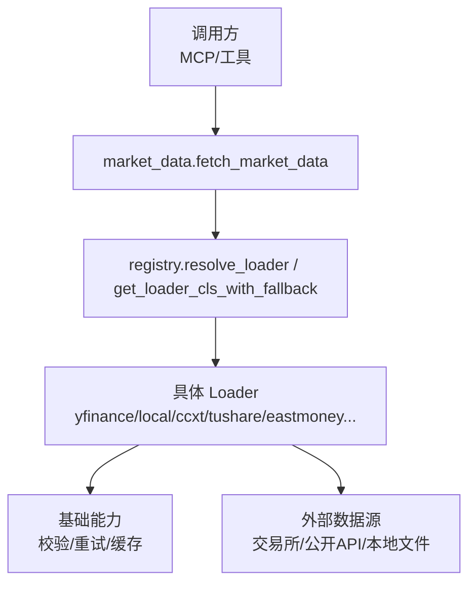
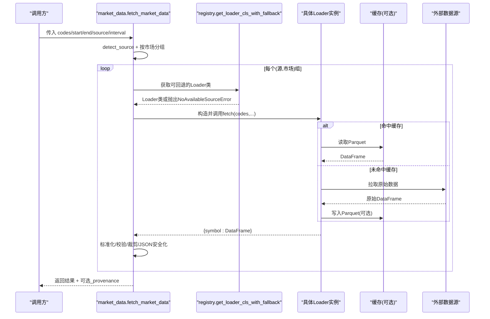
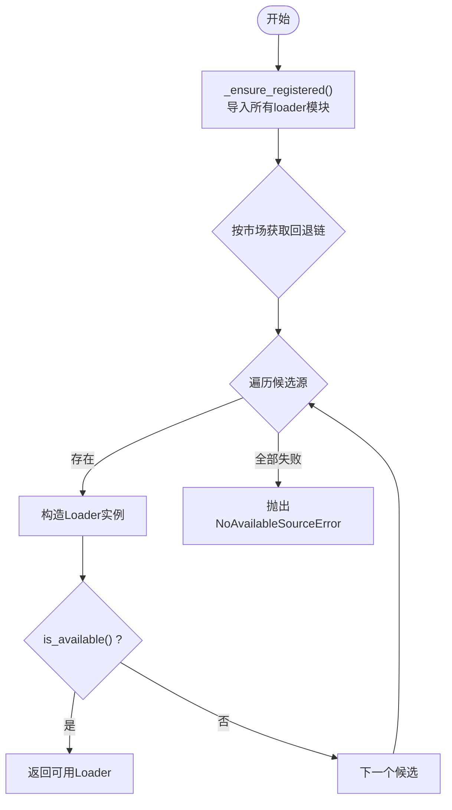
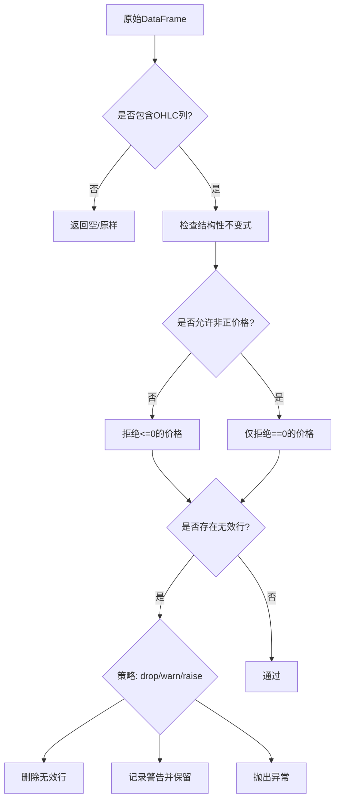
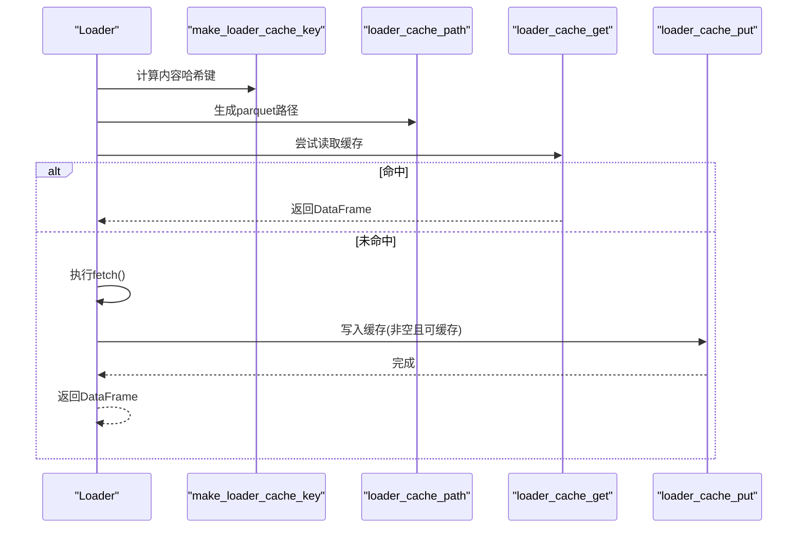
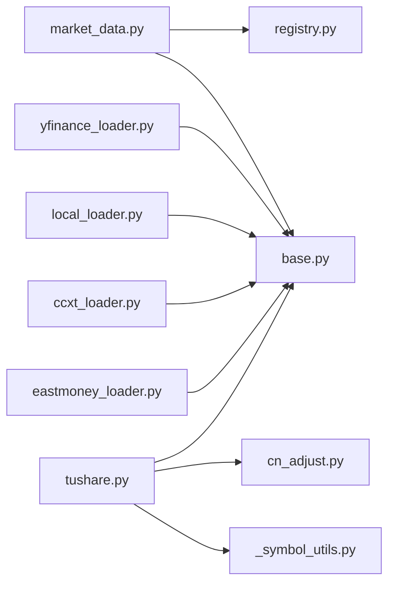

# 统一数据管理层

<cite>
**本文引用的文件**
- [registry.py](file://agent/backtest/loaders/registry.py)
- [base.py](file://agent/backtest/loaders/base.py)
- [market_data.py](file://agent/src/market_data.py)
- [yfinance_loader.py](file://agent/backtest/loaders/yfinance_loader.py)
- [local_loader.py](file://agent/backtest/loaders/local_loader.py)
- [ccxt_loader.py](file://agent/backtest/loaders/ccxt_loader.py)
- [tushare.py](file://agent/backtest/loaders/tushare.py)
- [eastmoney_loader.py](file://agent/backtest/loaders/eastmoney_loader.py)
- [_symbol_utils.py](file://agent/backtest/loaders/_symbol_utils.py)
- [cn_adjust.py](file://agent/backtest/loaders/cn_adjust.py)
</cite>

## 目录
1. [简介](#简介)
2. [项目结构](#项目结构)
3. [核心组件](#核心组件)
4. [架构总览](#架构总览)
5. [详细组件分析](#详细组件分析)
6. [依赖关系分析](#依赖关系分析)
7. [性能考量](#性能考量)
8. [故障排查指南](#故障排查指南)
9. [结论](#结论)
10. [附录](#附录)

## 简介
本文件为 Vibe-Trading 的统一数据管理层提供系统化文档，聚焦于“多源数据接入 + 一致访问接口”的架构设计。内容涵盖：
- 数据加载器注册机制与按市场类型的回退链
- 数据格式标准化（OHLCV）与校验规则
- 本地缓存策略（启用条件、键生成、读写流程）
- 错误处理与重试预算
- 各数据源特性对比、配置方法与性能调优建议
- 数据验证、缺失值处理与异常检测
- 自定义数据源开发指南（接口规范、测试要求、部署步骤）
- 查询、过滤与转换的实际使用示例

## 项目结构
统一数据管理层位于 agent/backtest/loaders 与 agent/src/market_data.py 中，采用“协议 + 注册表 + 回退链”的分层设计：
- 协议层：定义 DataLoaderProtocol，统一 fetch/is_available 等接口
- 注册层：LOADER_REGISTRY 与 @register 装饰器完成加载器自动发现
- 路由层：FALLBACK_CHAINS 按市场类型组织回退顺序；detect_source 将符号映射到首选源
- 工具层：日期/价格校验、重试预算、本地缓存、JSON 安全化等通用能力
- 入口层：fetch_market_data 聚合分组、回退、结果裁剪与溯源信息

图表来源
- [market_data.py:97-223](file://agent/src/market_data.py#L97-L223)
- [registry.py:158-248](file://agent/backtest/loaders/registry.py#L158-L248)
- [base.py:184-236](file://agent/backtest/loaders/base.py#L184-L236)

章节来源
- [market_data.py:1-229](file://agent/src/market_data.py#L1-L229)
- [registry.py:1-249](file://agent/backtest/loaders/registry.py#L1-L249)
- [base.py:1-645](file://agent/backtest/loaders/base.py#L1-L645)

## 核心组件
- 数据加载器协议与异常
  - DataLoaderProtocol：name/markets/requires_auth/is_available/fetch
  - NoAvailableSourceError：无可用数据源时抛出
- 注册表与回退链
  - LOADER_REGISTRY：全局注册表
  - FALLBACK_CHAINS：按市场类型定义优先顺序
  - _ensure_registered：懒加载所有 loader 模块以触发 @register
- 统一入口
  - detect_source：基于符号后缀/模式推断首选数据源
  - fetch_market_data：分组、选择回退链、调用 loader.fetch、结果裁剪与溯源
- 通用工具
  - validate_date_range / validate_ohlc：日期与 OHLC 不变式校验
  - retry_with_budget / check_budget：带超时预算的重试
  - cached_loader_fetch / loader_cache_*：可选本地 Parquet 缓存

章节来源
- [base.py:27-119](file://agent/backtest/loaders/base.py#L27-L119)
- [base.py:184-236](file://agent/backtest/loaders/base.py#L184-L236)
- [base.py:243-439](file://agent/backtest/loaders/base.py#L243-L439)
- [registry.py:23-155](file://agent/backtest/loaders/registry.py#L23-L155)
- [registry.py:158-248](file://agent/backtest/loaders/registry.py#L158-L248)
- [market_data.py:16-63](file://agent/src/market_data.py#L16-L63)
- [market_data.py:97-223](file://agent/src/market_data.py#L97-L223)

## 架构总览
下图展示从高层 API 到底层数据源的完整调用路径，包括回退链与缓存命中分支。

图表来源
- [market_data.py:97-223](file://agent/src/market_data.py#L97-L223)
- [registry.py:158-248](file://agent/backtest/loaders/registry.py#L158-L248)
- [base.py:343-439](file://agent/backtest/loaders/base.py#L343-L439)

## 详细组件分析

### 数据加载器注册与回退机制
- 注册机制
  - 通过 @register 装饰器将 Loader 类加入 LOADER_REGISTRY
  - _ensure_registered 在首次解析时导入所有已知 loader 模块，确保 registry 非空
- 回退链
  - FALLBACK_CHAINS 按市场维护有序候选源（如 a_share/us_equity/crypto 等）
  - resolve_loader 遍历链，尝试构造并 is_available()，失败则继续下一个
  - get_loader_cls_with_fallback 支持“显式源不可用时同市场回退”，但 local/qveris 禁止静默降级到网络源
- 符号到首选源
  - detect_source 根据正则匹配决定首选源（如 .HK/.US/-USDT/3字母对等）

图表来源
- [registry.py:71-115](file://agent/backtest/loaders/registry.py#L71-L115)
- [registry.py:158-193](file://agent/backtest/loaders/registry.py#L158-L193)
- [registry.py:196-248](file://agent/backtest/loaders/registry.py#L196-L248)

章节来源
- [registry.py:1-249](file://agent/backtest/loaders/registry.py#L1-L249)
- [market_data.py:16-63](file://agent/src/market_data.py#L16-L63)

### 数据格式标准化与校验
- 统一输出
  - 所有 Loader 需返回 {symbol: DataFrame}，DataFrame 索引为 trade_date，列包含 open/high/low/close/volume
- 校验规则
  - validate_date_range：起止日期合法性与顺序检查
  - validate_ohlc：结构性不变式（high>=low、高低价包围开收价）、非正价格限制（可配置允许负价）
- 本地文件重采样
  - local_loader 支持将任意粒度数据重采样到目标区间（降采样用标准OHLC聚合，升采样不支持）

图表来源
- [base.py:31-119](file://agent/backtest/loaders/base.py#L31-L119)
- [local_loader.py:83-127](file://agent/backtest/loaders/local_loader.py#L83-L127)

章节来源
- [base.py:31-119](file://agent/backtest/loaders/base.py#L31-L119)
- [local_loader.py:83-127](file://agent/backtest/loaders/local_loader.py#L83-L127)

### 缓存策略（本地 Parquet）
- 启用条件
  - 环境变量/配置开启 data.vibe_trading_data_cache
  - 仅对已结算区间（end_date < 今日）缓存，避免缓存进行中的K线
- 键生成
  - 基于 source/symbol/timeframe/start/end/fields 的内容寻址哈希
- 读写流程
  - 读：若命中则直接返回；否则调用 fetch 并写回
  - 写：原子替换 tmp -> 最终文件，附带元数据（索引列、dtype 等）
- 容错
  - 读/写失败均不中断主流程，降级为实时拉取

图表来源
- [base.py:243-439](file://agent/backtest/loaders/base.py#L243-L439)

章节来源
- [base.py:243-439](file://agent/backtest/loaders/base.py#L243-L439)

### 错误处理与重试预算
- 重试预算
  - retry_with_budget：针对声明的瞬态异常，按 backoff 重试并在 deadline 前终止
  - check_budget：分页拉取间检查剩余时间，防止长时间挂起
- 特定源限流
  - tushare：识别配额拒绝关键词并退避重试
  - ccxt：通过 CCXT_TIMEOUT_MS / CCXT_FETCH_BUDGET_S 控制超时与整体预算
- 回退链异常
  - market_data 捕获单个源异常后继续尝试链中下一个源，保证批量鲁棒性

章节来源
- [base.py:184-236](file://agent/backtest/loaders/base.py#L184-L236)
- [tushare.py:18-79](file://agent/backtest/loaders/tushare.py#L18-L79)
- [ccxt_loader.py:50-57](file://agent/backtest/loaders/ccxt_loader.py#L50-L57)
- [market_data.py:170-190](file://agent/src/market_data.py#L170-L190)

### 各数据源特性对比与配置要点
- yfinance_loader
  - 适用市场：美股、港股、印度、加拿大、加密货币（部分）
  - 特点：公共端点为主，注意频率限制；区间映射与符号规范化
  - 参考：[yfinance_loader.py:1-200](file://agent/backtest/loaders/yfinance_loader.py#L1-L200)
- local_loader
  - 适用场景：本地 CSV/Parquet/DuckDB，灵活列映射与日期格式
  - 特点：支持重采样；配置路径 ~/.vibe-trading/data-bridge/config.yaml
  - 参考：[local_loader.py:1-200](file://agent/backtest/loaders/local_loader.py#L1-L200)
- ccxt_loader
  - 适用市场：加密货币（100+交易所）
  - 特点：代理设置、超时与预算控制、永续合约符号解析
  - 参考：[ccxt_loader.py:1-200](file://agent/backtest/loaders/ccxt_loader.py#L1-L200)
- tushare
  - 适用市场：A股、港股、期货、基金
  - 特点：需要 token；分钟级数据走专用接口；除权因子前复权调整
  - 参考：[tushare.py:1-200](file://agent/backtest/loaders/tushare.py#L1-L200), [cn_adjust.py:1-78](file://agent/backtest/loaders/cn_adjust.py#L1-L78)
- eastmoney_loader
  - 适用市场：A股、港股、美股
  - 特点：免费无鉴权，严格限速；通过客户端统一节流
  - 参考：[eastmoney_loader.py:1-177](file://agent/backtest/loaders/eastmoney_loader.py#L1-L177)

章节来源
- [yfinance_loader.py:1-200](file://agent/backtest/loaders/yfinance_loader.py#L1-L200)
- [local_loader.py:1-200](file://agent/backtest/loaders/local_loader.py#L1-L200)
- [ccxt_loader.py:1-200](file://agent/backtest/loaders/ccxt_loader.py#L1-L200)
- [tushare.py:1-200](file://agent/backtest/loaders/tushare.py#L1-L200)
- [eastmoney_loader.py:1-177](file://agent/backtest/loaders/eastmoney_loader.py#L1-L177)
- [cn_adjust.py:1-78](file://agent/backtest/loaders/cn_adjust.py#L1-L78)

### 数据查询、过滤与转换示例
- 基本查询
  - 使用 fetch_market_data 传入 codes/start/end/source/interval，自动分组与回退
  - 参考：[market_data.py:97-223](file://agent/src/market_data.py#L97-L223)
- 过滤与裁剪
  - cap_rows 对结果行进行等步长采样并固定最后一根K线，控制载荷大小
  - 参考：[market_data.py:66-84](file://agent/src/market_data.py#L66-L84)
- 转换与标准化
  - 各 loader 内部完成符号/区间映射、列名归一、数值类型转换与 OHLC 校验
  - 参考：[yfinance_loader.py:172-200](file://agent/backtest/loaders/yfinance_loader.py#L172-L200), [eastmoney_loader.py:145-177](file://agent/backtest/loaders/eastmoney_loader.py#L145-L177)
- 本地数据重采样
  - local_loader 将小时/分钟级本地数据按目标区间聚合
  - 参考：[local_loader.py:83-127](file://agent/backtest/loaders/local_loader.py#L83-L127)

章节来源
- [market_data.py:66-84](file://agent/src/market_data.py#L66-L84)
- [market_data.py:97-223](file://agent/src/market_data.py#L97-L223)
- [yfinance_loader.py:172-200](file://agent/backtest/loaders/yfinance_loader.py#L172-L200)
- [eastmoney_loader.py:145-177](file://agent/backtest/loaders/eastmoney_loader.py#L145-L177)
- [local_loader.py:83-127](file://agent/backtest/loaders/local_loader.py#L83-L127)

### 自定义数据源开发指南
- 接口规范
  - 实现 DataLoaderProtocol：name/markets/requires_auth/is_available/fetch
  - fetch 必须返回 {symbol: DataFrame}，索引为 trade_date，列含 open/high/low/close/volume
  - 参考：[base.py:618-645](file://agent/backtest/loaders/base.py#L618-L645)
- 注册与发现
  - 使用 @register 装饰器，确保模块被 import 时进入 LOADER_REGISTRY
  - 若需加入回退链，请在 FALLBACK_CHAINS 对应市场添加
  - 参考：[registry.py:62-68](file://agent/backtest/loaders/registry.py#L62-L68), [registry.py:136-155](file://agent/backtest/loaders/registry.py#L136-L155)
- 数据校验与缓存
  - 在 fetch 内调用 validate_date_range / validate_ohlc
  - 使用 cached_loader_fetch 包装拉取逻辑以获得缓存加速
  - 参考：[base.py:31-119](file://agent/backtest/loaders/base.py#L31-L119), [base.py:401-439](file://agent/backtest/loaders/base.py#L401-L439)
- 重试与预算
  - 对外部不稳定接口使用 retry_with_budget 与 check_budget，避免长时间阻塞
  - 参考：[base.py:184-236](file://agent/backtest/loaders/base.py#L184-L236)
- 测试要求
  - 覆盖 is_available 在不同环境下的行为
  - 覆盖 fetch 的边界：空结果、非法日期、非正价格、区间不合法
  - 验证缓存命中与未命中路径
  - 参考：[base.py:31-119](file://agent/backtest/loaders/base.py#L31-L119), [base.py:343-439](file://agent/backtest/loaders/base.py#L343-L439)
- 部署步骤
  - 将新 loader 模块加入 _ensure_registered 的导入列表
  - 在 VALID_SOURCES 中添加名称（如需）
  - 在 FALLBACK_CHAINS 中按市场优先级插入
  - 参考：[registry.py:83-108](file://agent/backtest/loaders/registry.py#L83-L108), [registry.py:27-59](file://agent/backtest/loaders/registry.py#L27-L59), [registry.py:136-155](file://agent/backtest/loaders/registry.py#L136-L155)

章节来源
- [base.py:31-119](file://agent/backtest/loaders/base.py#L31-L119)
- [base.py:401-439](file://agent/backtest/loaders/base.py#L401-L439)
- [registry.py:27-59](file://agent/backtest/loaders/registry.py#L27-L59)
- [registry.py:83-108](file://agent/backtest/loaders/registry.py#L83-L108)
- [registry.py:136-155](file://agent/backtest/loaders/registry.py#L136-L155)

## 依赖关系分析
- 组件耦合
  - market_data 依赖 registry 与 base，负责编排与结果收敛
  - 各 loader 依赖 base 提供的校验/缓存/重试能力
  - tushare 额外依赖 cn_adjust 做前复权调整；_symbol_utils 提供 ETF 标识
- 外部依赖
  - yfinance/ccxt/tushare/eastmoney 等第三方库
  - DuckDB 用于缓存读写（可选）

图表来源
- [market_data.py:97-223](file://agent/src/market_data.py#L97-L223)
- [registry.py:158-248](file://agent/backtest/loaders/registry.py#L158-L248)
- [base.py:184-439](file://agent/backtest/loaders/base.py#L184-L439)
- [tushare.py:1-200](file://agent/backtest/loaders/tushare.py#L1-L200)
- [cn_adjust.py:1-78](file://agent/backtest/loaders/cn_adjust.py#L1-L78)
- [_symbol_utils.py:1-21](file://agent/backtest/loaders/_symbol_utils.py#L1-L21)

章节来源
- [market_data.py:97-223](file://agent/src/market_data.py#L97-L223)
- [registry.py:158-248](file://agent/backtest/loaders/registry.py#L158-L248)
- [base.py:184-439](file://agent/backtest/loaders/base.py#L184-L439)
- [tushare.py:1-200](file://agent/backtest/loaders/tushare.py#L1-L200)
- [cn_adjust.py:1-78](file://agent/backtest/loaders/cn_adjust.py#L1-L78)
- [_symbol_utils.py:1-21](file://agent/backtest/loaders/_symbol_utils.py#L1-L21)

## 性能考量
- 回退链优化
  - 将轻量、低封禁风险的源置于前端（如腾讯、Yahoo），密钥型与易限流源后置
  - 参考：[registry.py:131-155](file://agent/backtest/loaders/registry.py#L131-L155)
- 缓存命中
  - 合理设置 start/end 区间，避免频繁请求；利用 content-addressed 键减少重复
  - 参考：[base.py:284-340](file://agent/backtest/loaders/base.py#L284-L340)
- 重试与预算
  - 为不稳定接口设置合理的 backoff 与 deadline，避免雪崩
  - 参考：[base.py:184-236](file://agent/backtest/loaders/base.py#L184-L236)
- 结果裁剪
  - 使用 cap_rows 控制返回行数，降低传输与序列化开销
  - 参考：[market_data.py:66-84](file://agent/src/market_data.py#L66-L84)
- 本地重采样
  - 尽量提供高频本地数据，按需降采样，避免向上插值
  - 参考：[local_loader.py:83-127](file://agent/backtest/loaders/local_loader.py#L83-L127)

## 故障排查指南
- 无可用数据源
  - 现象：抛出 NoAvailableSourceError
  - 排查：检查网络、token、依赖安装；确认回退链中是否有可用源
  - 参考：[registry.py:158-193](file://agent/backtest/loaders/registry.py#L158-L193), [base.py:27-29](file://agent/backtest/loaders/base.py#L27-L29)
- 数据校验失败
  - 现象：validate_ohlc 抛错或删除大量行
  - 排查：检查 high/low/open/close 逻辑一致性；必要时调整 allow_nonpositive_prices
  - 参考：[base.py:50-119](file://agent/backtest/loaders/base.py#L50-L119)
- 缓存未命中或损坏
  - 现象：仍走网络拉取或日志提示读取失败
  - 排查：确认缓存开关、end_date 是否已结算；查看 parquet 与元数据完整性
  - 参考：[base.py:343-439](file://agent/backtest/loaders/base.py#L343-L439)
- 限流与超时
  - 现象：请求频繁失败或长时间挂起
  - 排查：调整 backoff、CCXT_TIMEOUT_MS、CCXT_FETCH_BUDGET_S；检查 tushare 配额提示
  - 参考：[tushare.py:18-79](file://agent/backtest/loaders/tushare.py#L18-L79), [ccxt_loader.py:50-57](file://agent/backtest/loaders/ccxt_loader.py#L50-L57), [base.py:184-236](file://agent/backtest/loaders/base.py#L184-L236)

章节来源
- [registry.py:158-193](file://agent/backtest/loaders/registry.py#L158-L193)
- [base.py:27-29](file://agent/backtest/loaders/base.py#L27-L29)
- [base.py:50-119](file://agent/backtest/loaders/base.py#L50-L119)
- [base.py:343-439](file://agent/backtest/loaders/base.py#L343-L439)
- [tushare.py:18-79](file://agent/backtest/loaders/tushare.py#L18-L79)
- [ccxt_loader.py:50-57](file://agent/backtest/loaders/ccxt_loader.py#L50-L57)

## 结论
统一数据管理层通过“协议 + 注册表 + 回退链 + 通用工具”的组合，实现了跨市场、跨供应商的一致数据访问。其关键优势在于：
- 稳定的接口契约与严格的 OHLC 校验
- 健壮的回退链与受限重试预算，提升可用性
- 可选本地缓存显著降低重复请求成本
- 灵活的符号路由与本地文件重采样能力
- 可扩展的自定义数据源开发与部署流程

## 附录
- 常用环境变量
  - VIBE_TRADING_DATA_CACHE：启用本地缓存
  - VIBE_TRADING_DATA_CACHE_ROOT：缓存根目录
  - CCXT_TIMEOUT_MS / CCXT_FETCH_BUDGET_S：CCXT 超时与预算
  - TUSHARE_TOKEN：Tushare 鉴权令牌
- 配置位置
  - 本地数据桥配置：~/.vibe-trading/data-bridge/config.yaml
- 相关工具函数路径
  - 日期/价格校验：[base.py:31-119](file://agent/backtest/loaders/base.py#L31-L119)
  - 重试与预算：[base.py:184-236](file://agent/backtest/loaders/base.py#L184-L236)
  - 缓存读写：[base.py:343-439](file://agent/backtest/loaders/base.py#L343-L439)
  - 统一入口：[market_data.py:97-223](file://agent/src/market_data.py#L97-L223)