# 系统架构总览

<cite>
**本文引用的文件**
- [agent/api_server.py](file://agent/api_server.py)
- [agent/mcp_server.py](file://agent/mcp_server.py)
- [frontend/src/main.tsx](file://frontend/src/main.tsx)
- [desktop/electron/src/main.ts](file://desktop/electron/src/main.ts)
- [docker-compose.yml](file://docker-compose.yml)
- [agent/src/agent/__init__.py](file://agent/src/agent/__init__.py)
- [agent/src/agent/loop.py](file://agent/src/agent/loop.py)
- [agent/src/tools/__init__.py](file://agent/src/tools/__init__.py)
- [agent/src/agent/tools.py](file://agent/src/agent/tools.py)
- [agent/src/memory/persistent.py](file://agent/src/memory/persistent.py)
- [agent/src/session/service.py](file://agent/src/session/service.py)
</cite>

## 目录
1. [简介](#简介)
2. [项目结构](#项目结构)
3. [核心组件](#核心组件)
4. [架构总览](#架构总览)
5. [详细组件分析](#详细组件分析)
6. [依赖关系分析](#依赖关系分析)
7. [性能与可扩展性](#性能与可扩展性)
8. [可观测性与监控](#可观测性与监控)
9. [故障排查指南](#故障排查指南)
10. [结论](#结论)
11. [附录：部署拓扑图](#附录部署拓扑图)

## 简介
本文件为 Vibe-Trading 的系统架构总览，面向产品、研发与运维读者，说明前后端分离的设计模式：React 前端通过 REST API 和 WebSocket/SSE 与 FastAPI 后端通信；Electron 桌面应用作为本地客户端封装并管理后端进程。文档重点阐述 API 网关、Agent 核心、工具注册表、记忆系统与会话管理等关键组件，解释数据流向（用户请求→API 路由→Agent 处理→工具调用→数据获取→结果返回），并给出生产部署拓扑与可观测性建议。

## 项目结构
- 前端（React + Vite）：提供 Web UI，负责页面路由、状态管理与与后端的 HTTP/WebSocket 通信。
- 后端（FastAPI）：统一 API 网关，挂载安全中间件、CORS、SPA 静态资源托管，按功能域注册路由模块（运行、会话、设置、上传、通道、群智、实盘、Alpha 等）。
- Agent 核心：ReAct 循环驱动 LLM 推理与工具编排，内置上下文压缩、心跳、追踪与使用量统计。
- 工具注册表：自动发现 BaseTool 子类，支持本地工具与远程 MCP 工具合并注册，具备白名单过滤与安全策略。
- 记忆系统：基于文件的跨会话持久化记忆，含重要性衰减、去重、索引与并发锁。
- 会话管理：会话生命周期、消息持久化、SSE 事件总线、尝试（Attempt）调度与并发控制。
- Electron 桌面：启动/停止后端进程、注入鉴权头、安全限制渲染进程权限、日志与凭据管理。
- 容器化：Docker Compose 编排后端服务与可选的前端开发服务，卷持久化关键数据，运行时加固。

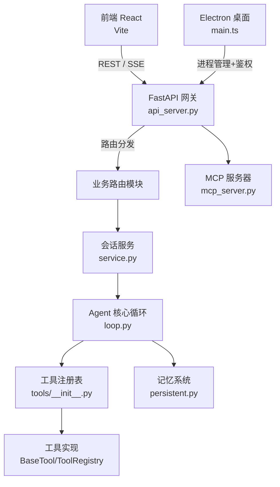

**图表来源**
- [agent/api_server.py:163-239](file://agent/api_server.py#L163-L239)
- [agent/src/session/service.py:53-91](file://agent/src/session/service.py#L53-L91)
- [agent/src/agent/loop.py:1-12](file://agent/src/agent/loop.py#L1-L12)
- [agent/src/tools/__init__.py:66-115](file://agent/src/tools/__init__.py#L66-L115)
- [agent/mcp_server.py:1-50](file://agent/mcp_server.py#L1-L50)

**章节来源**
- [agent/api_server.py:163-239](file://agent/api_server.py#L163-L239)
- [frontend/src/main.tsx:1-36](file://frontend/src/main.tsx#L1-L36)
- [desktop/electron/src/main.ts:65-117](file://desktop/electron/src/main.ts#L65-L117)
- [docker-compose.yml:1-66](file://docker-compose.yml#L1-L66)

## 核心组件
- API 网关（FastAPI）
  - 职责：创建应用、挂载 CORS/安全中间件、注册各功能路由、提供 SPA 静态资源、启动/关闭后台任务（定时研究、通道运行时）。
  - 关键点：生命周期钩子执行预检、迁移与启动；访问日志脱敏；端口/主机绑定与开发模式联动 Vite。
- Agent 核心（ReAct 循环）
  - 职责：五层上下文管理（微紧凑、折叠、自动摘要、显式压缩、迭代更新）、工具并行执行、心跳与进度事件、LLM 用量聚合与持久化。
  - 关键点：超时、重试、内容过滤、Token 预算与尾保护。
- 工具注册表
  - 职责：自动发现 BaseTool 子类，构建 ToolRegistry；支持本地工具与远程 MCP 工具合并；白名单过滤与安全策略（如禁用 shell 工具）。
  - 关键点：MCP 服务器隔离、失败不扩散、活券商通道包装与授权检查。
- 记忆系统
  - 职责：跨会话持久化存储、重要性衰减、去重、搜索索引、并发锁。
  - 关键点：文件级锁、滑动窗口去重、非拉丁字符分词、截断与清理。
- 会话管理
  - 职责：会话创建/查询/删除、消息追加、SSE 事件发布、尝试调度与并发控制（每会话单实例）。
  - 关键点：抢占式预留防止并发冲突、线程池限制 Agent 并发、终端状态事件映射。

**章节来源**
- [agent/api_server.py:127-183](file://agent/api_server.py#L127-L183)
- [agent/src/agent/loop.py:1-12](file://agent/src/agent/loop.py#L1-L12)
- [agent/src/tools/__init__.py:66-115](file://agent/src/tools/__init__.py#L66-L115)
- [agent/src/memory/persistent.py:196-200](file://agent/src/memory/persistent.py#L196-L200)
- [agent/src/session/service.py:53-91](file://agent/src/session/service.py#L53-L91)

## 架构总览
整体采用前后端分离与模块化微服务思想：
- 前端（React）通过 REST 与 SSE/WebSocket 与后端交互，Electron 作为本地客户端封装后端进程并提供安全边界。
- 后端以 FastAPI 为统一入口，按领域拆分路由模块，内部通过会话服务协调 Agent 循环与工具执行。
- 工具体系支持本地与远程 MCP 工具，便于扩展第三方能力并保持安全隔离。
- 记忆与会话提供跨会话状态与事件流，支撑长时研究与多轮对话。

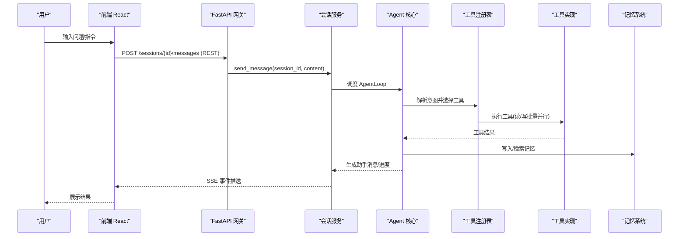

**图表来源**
- [agent/src/session/service.py:158-200](file://agent/src/session/service.py#L158-L200)
- [agent/src/agent/loop.py:1-12](file://agent/src/agent/loop.py#L1-L12)
- [agent/src/tools/__init__.py:66-115](file://agent/src/tools/__init__.py#L66-L115)
- [agent/src/memory/persistent.py:196-200](file://agent/src/memory/persistent.py#L196-L200)

## 详细组件分析

### API 网关（FastAPI）
- 启动流程：生命周期钩子执行预检、配置迁移、启动定时研究与可选通道运行时。
- 中间件：CORS、安全头、SPA 深链回退、拒绝不可信回环主机。
- 路由挂载：运行、会话、系统、设置、上传、通道、群智、实盘、Alpha、认证、OpenBB 桥接等。
- 静态资源：生产环境挂载前端 dist，开发模式启动 Vite 并输出调试信息。
- 日志：安装访问日志脱敏过滤器，避免敏感参数泄露。

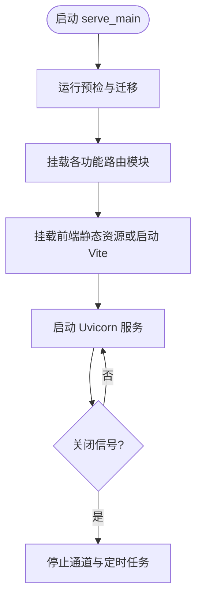

**图表来源**
- [agent/api_server.py:127-183](file://agent/api_server.py#L127-L183)
- [agent/api_server.py:321-395](file://agent/api_server.py#L321-L395)

**章节来源**
- [agent/api_server.py:127-183](file://agent/api_server.py#L127-L183)
- [agent/api_server.py:321-395](file://agent/api_server.py#L321-L395)

### Agent 核心（ReAct 循环）
- 上下文管理：五层压缩策略，降低长上下文成本，保留最近片段与结构化摘要。
- 工具执行：连续只读工具并行执行，提升吞吐；支持超时与重试。
- 可观测性：心跳、进度事件、TraceWriter、LLM 用量聚合与持久化。
- 安全与合规：内容过滤、结果脱敏、Token 预算与尾保护。

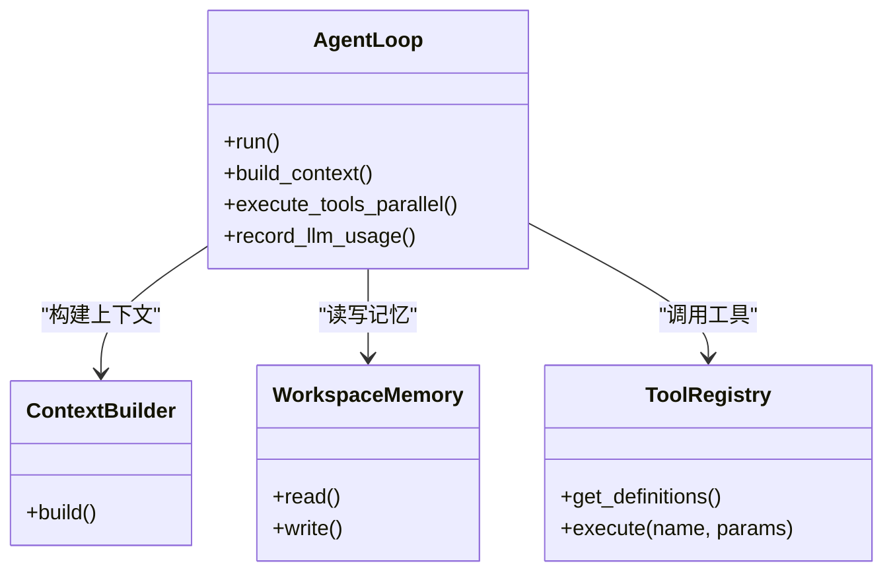

**图表来源**
- [agent/src/agent/loop.py:1-12](file://agent/src/agent/loop.py#L1-L12)
- [agent/src/agent/tools.py:54-95](file://agent/src/agent/tools.py#L54-L95)

**章节来源**
- [agent/src/agent/loop.py:1-12](file://agent/src/agent/loop.py#L1-L12)
- [agent/src/agent/tools.py:54-95](file://agent/src/agent/tools.py#L54-L95)

### 工具注册表
- 自动发现：扫描 src/tools 包下所有 BaseTool 子类，缓存结果。
- 构建策略：优先注册本地工具，再根据配置附加远程 MCP 工具；失败隔离，不影响其他服务器。
- 安全策略：默认禁用 shell 工具；对活券商通道进行包装与授权检查；支持白名单过滤。
- 接口：提供 get_definitions 与 execute，统一错误封装。

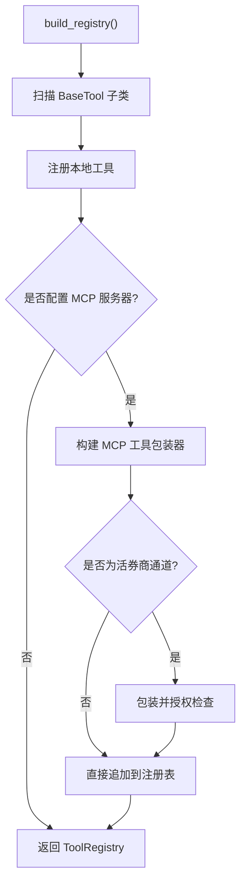

**图表来源**
- [agent/src/tools/__init__.py:66-115](file://agent/src/tools/__init__.py#L66-L115)
- [agent/src/tools/__init__.py:155-245](file://agent/src/tools/__init__.py#L155-L245)

**章节来源**
- [agent/src/tools/__init__.py:66-115](file://agent/src/tools/__init__.py#L66-L115)
- [agent/src/tools/__init__.py:155-245](file://agent/src/tools/__init__.py#L155-L245)

### 记忆系统
- 存储模型：MemoryEntry 包含标题、描述、类型、正文、时间戳、质量分、访问计数、重要性、相关记忆等。
- 并发与一致性：文件级独占锁，超时释放；Windows 兼容路径。
- 去重与检索：滑动窗口去重、非拉丁字符分词、搜索索引。
- 重要性衰减：Ebbinghaus 风格衰减公式，结合访问奖励。

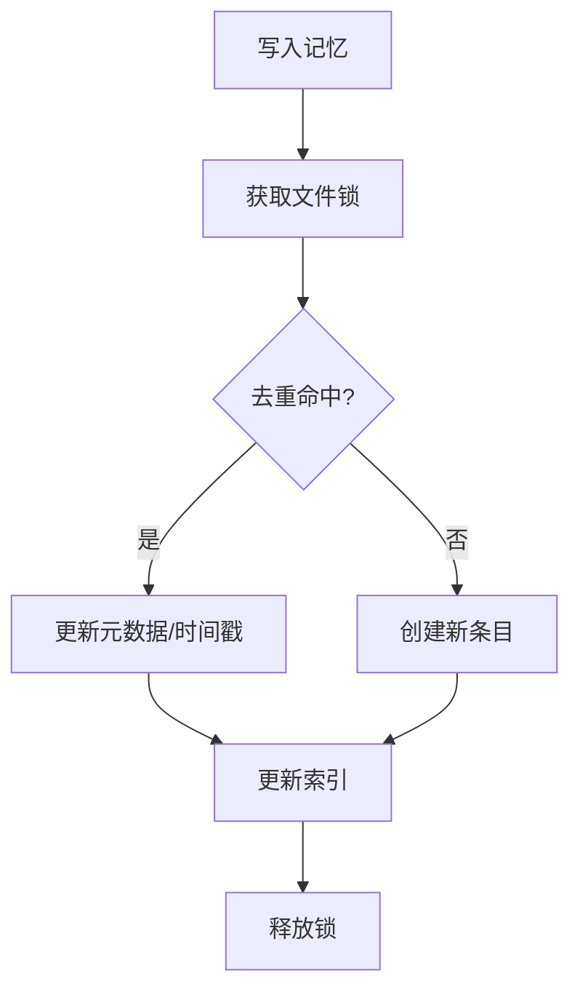

**图表来源**
- [agent/src/memory/persistent.py:41-73](file://agent/src/memory/persistent.py#L41-L73)
- [agent/src/memory/persistent.py:196-200](file://agent/src/memory/persistent.py#L196-L200)

**章节来源**
- [agent/src/memory/persistent.py:41-73](file://agent/src/memory/persistent.py#L41-L73)
- [agent/src/memory/persistent.py:196-200](file://agent/src/memory/persistent.py#L196-L200)

### 会话管理
- 生命周期：创建、查询、列表、删除；消息追加与搜索索引更新。
- 并发控制：每会话单实例，抢占式预留防止并发冲突；线程池限制 Agent 并发。
- 事件流：SSE 事件总线，将消息接收、尝试完成/取消/失败等事件推送至前端。
- 错误处理：SessionBusyError 用于 409 冲突提示；异常捕获与状态回滚。

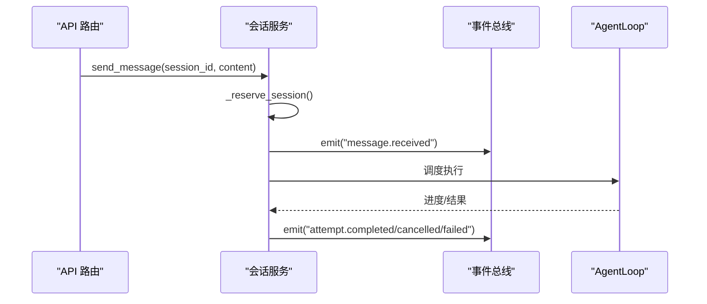

**图表来源**
- [agent/src/session/service.py:53-91](file://agent/src/session/service.py#L53-L91)
- [agent/src/session/service.py:158-200](file://agent/src/session/service.py#L158-L200)

**章节来源**
- [agent/src/session/service.py:53-91](file://agent/src/session/service.py#L53-L91)
- [agent/src/session/service.py:158-200](file://agent/src/session/service.py#L158-L200)

### MCP 服务器（可选扩展点）
- 传输方式：stdio、SSE（遗留）、Streamable HTTP（当前默认）。
- 安全加固：Host/Origin 白名单中间件，防御 DNS 重绑定；默认仅允许回环地址。
- 工具暴露：技能、目标、回测、因子、市场数据、基本面、新闻、发现、交易连接器读取、群智编排、影子账户分析等；明确禁止下单/撤单工具。
- 会话隔离：进程级会话 ID 默认稳定，支持客户端传入会话标识。

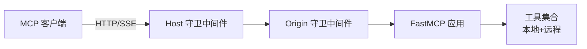

**图表来源**
- [agent/mcp_server.py:131-317](file://agent/mcp_server.py#L131-L317)
- [agent/mcp_server.py:1-50](file://agent/mcp_server.py#L1-L50)

**章节来源**
- [agent/mcp_server.py:131-317](file://agent/mcp_server.py#L131-L317)
- [agent/mcp_server.py:1-50](file://agent/mcp_server.py#L1-L50)

### 前端与 Electron 客户端
- 前端：React 入口初始化路由、错误边界、通知与懒加载优化。
- Electron：主进程创建窗口、注入安全偏好、拦截导航与外链、IPC 通信、后端进程管理、凭据存储、日志与菜单。
- 安全：渲染进程禁用 Node 集成与沙箱启用；仅向可信后端源注入 Bearer Token；外部链接白名单校验。

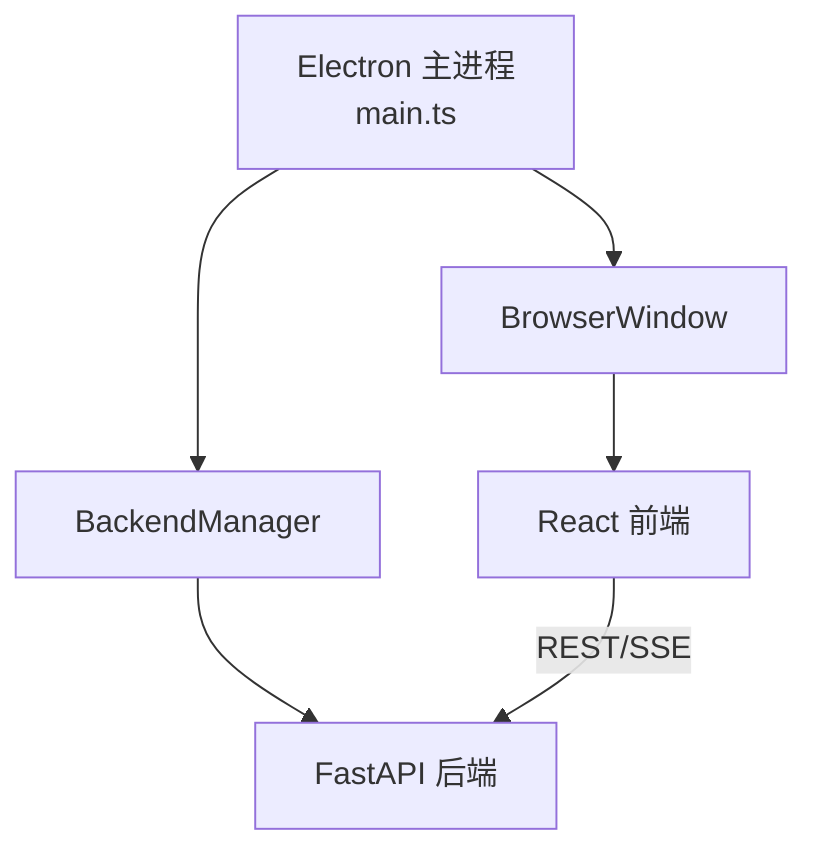

**图表来源**
- [desktop/electron/src/main.ts:65-117](file://desktop/electron/src/main.ts#L65-L117)
- [desktop/electron/src/main.ts:159-192](file://desktop/electron/src/main.ts#L159-L192)
- [frontend/src/main.tsx:1-36](file://frontend/src/main.tsx#L1-L36)

**章节来源**
- [desktop/electron/src/main.ts:65-117](file://desktop/electron/src/main.ts#L65-L117)
- [desktop/electron/src/main.ts:159-192](file://desktop/electron/src/main.ts#L159-L192)
- [frontend/src/main.tsx:1-36](file://frontend/src/main.tsx#L1-L36)

## 依赖关系分析
- 组件耦合
  - API 网关依赖会话服务、工具注册表、MCP 服务器与各类路由模块。
  - 会话服务依赖事件总线、存储与 Agent 核心。
  - Agent 核心依赖上下文构建、记忆系统与工具注册表。
  - 工具注册表依赖 BaseTool 与 MCP 适配器。
- 外部依赖
  - FastAPI/Uvicorn 提供 ASGI 服务。
  - Docker Compose 编排服务与卷持久化。
  - 可选 Ollama 本地 LLM 服务。
- 潜在循环依赖
  - 通过分层与延迟导入避免循环；例如在路由中按需导入模块。

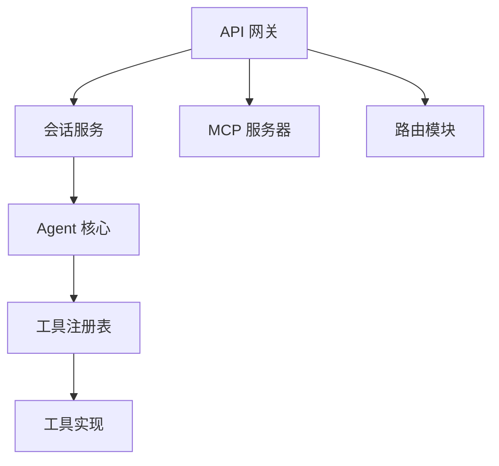

**图表来源**
- [agent/api_server.py:163-239](file://agent/api_server.py#L163-L239)
- [agent/src/session/service.py:53-91](file://agent/src/session/service.py#L53-L91)
- [agent/src/agent/loop.py:1-12](file://agent/src/agent/loop.py#L1-L12)
- [agent/src/tools/__init__.py:66-115](file://agent/src/tools/__init__.py#L66-L115)

**章节来源**
- [agent/api_server.py:163-239](file://agent/api_server.py#L163-L239)
- [agent/src/session/service.py:53-91](file://agent/src/session/service.py#L53-L91)
- [agent/src/agent/loop.py:1-12](file://agent/src/agent/loop.py#L1-L12)
- [agent/src/tools/__init__.py:66-115](file://agent/src/tools/__init__.py#L66-L115)

## 性能与可扩展性
- 性能
  - 工具并行执行：连续只读工具批量并行，提升吞吐。
  - 上下文压缩：多层压缩减少 LLM 输入长度，降低成本。
  - 资源限制：容器内 CPU/内存/PID 限制，防止失控。
- 可扩展性
  - 模块化路由：新增功能只需注册路由模块。
  - 工具注册表：新增工具即插即用，支持远程 MCP 扩展。
  - 独立部署：各组件可通过容器或服务网格独立扩缩容。

[本节提供通用指导，无需特定文件引用]

## 可观测性与监控
- 日志
  - 访问日志脱敏：避免 API Key/Ticket 泄露。
  - 工具执行异常：统一记录工具失败与堆栈。
  - 前端错误边界：捕获渲染期异常并提示。
- 指标
  - LLM 用量：逐迭代累计输入/输出/总 Token 数与调用次数，持久化为 JSON 工件。
  - 心跳与进度：AgentLoop 定期发出心跳与阶段事件，便于 UI 与监控采集。
- 追踪
  - TraceWriter：记录工具调用链路与结果，便于回溯。
  - SSE 事件：会话级事件流，便于实时观察与审计。

**章节来源**
- [agent/api_server.py:384-387](file://agent/api_server.py#L384-L387)
- [agent/src/agent/loop.py:175-200](file://agent/src/agent/loop.py#L175-L200)
- [frontend/src/main.tsx:28-35](file://frontend/src/main.tsx#L28-L35)

## 故障排查指南
- 常见问题
  - 会话忙：409 冲突，等待或取消当前尝试。
  - 工具不可用：依赖缺失或安全检查未通过，查看日志中的跳过原因。
  - MCP 连接失败：网络或鉴权问题，检查 Host/Origin 白名单与凭据。
  - 前端无法加载：确认后端静态资源挂载或 Vite 开发服务器状态。
- 定位步骤
  - 查看后端访问日志与工具异常日志。
  - 检查容器资源限制与卷挂载是否正确。
  - 验证环境变量与凭据存储状态。

**章节来源**
- [agent/src/session/service.py:43-50](file://agent/src/session/service.py#L43-L50)
- [agent/src/tools/__init__.py:136-153](file://agent/src/tools/__init__.py#L136-L153)
- [agent/mcp_server.py:229-286](file://agent/mcp_server.py#L229-L286)
- [agent/api_server.py:371-377](file://agent/api_server.py#L371-L377)

## 结论
Vibe-Trading 采用前后端分离与模块化设计，通过 FastAPI 统一网关、ReAct Agent 核心、工具注册表、记忆系统与会话管理，实现了高内聚、低耦合的金融研究与交易辅助平台。其优势在于：
- 模块化：按领域拆分路由与组件，易于维护与测试。
- 可扩展性：工具注册表支持本地与远程 MCP 工具，灵活接入第三方能力。
- 独立部署：容器化与资源限制保障稳定性，便于横向扩展。
- 可观测性：日志、指标与事件流覆盖全链路，便于监控与排障。

[本节总结性内容，无需特定文件引用]

## 附录：部署拓扑图
生产环境建议拓扑：
- 反向代理（Nginx/云厂商 LB）：终止 TLS，转发至后端与前端。
- 后端服务（FastAPI）：单实例或多副本，共享卷持久化 runs/sessions/uploads。
- 前端服务（React 静态资源）：由后端或 CDN 托管。
- 数据库/缓存（可选）：会话索引或缓存加速。
- 外部服务：LLM（本地 Ollama 或云端）、数据源（交易所/行情 API）。

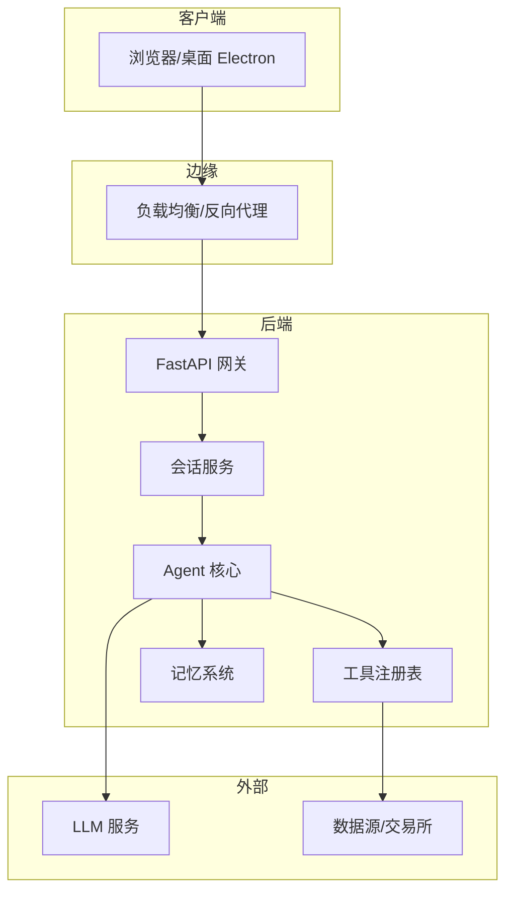

**图表来源**
- [docker-compose.yml:1-66](file://docker-compose.yml#L1-L66)
- [agent/api_server.py:163-239](file://agent/api_server.py#L163-L239)
- [agent/src/session/service.py:53-91](file://agent/src/session/service.py#L53-L91)
- [agent/src/agent/loop.py:1-12](file://agent/src/agent/loop.py#L1-L12)
- [agent/src/tools/__init__.py:66-115](file://agent/src/tools/__init__.py#L66-L115)
- [agent/src/memory/persistent.py:196-200](file://agent/src/memory/persistent.py#L196-L200)