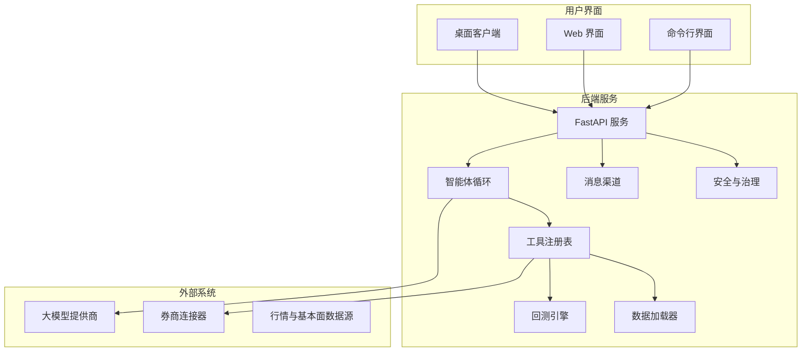
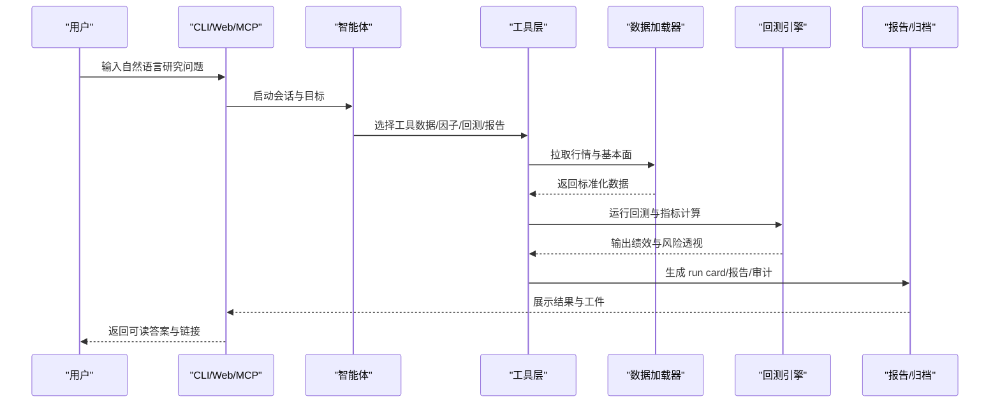
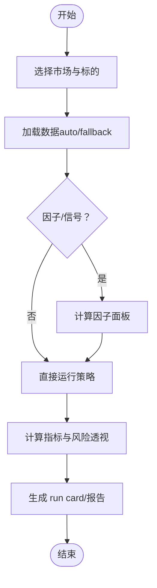
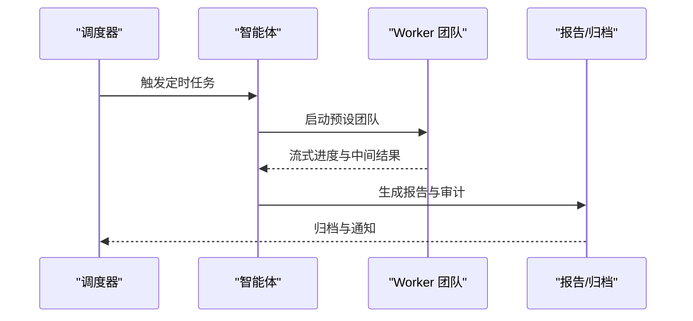
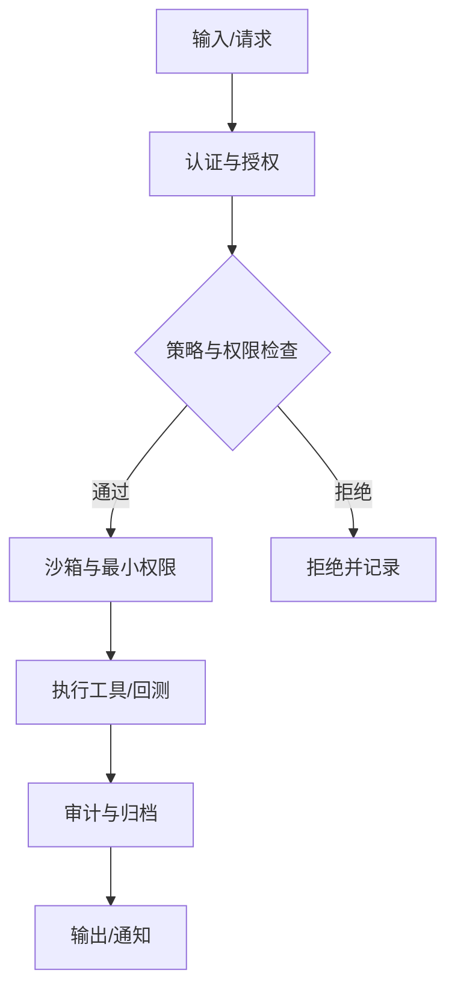
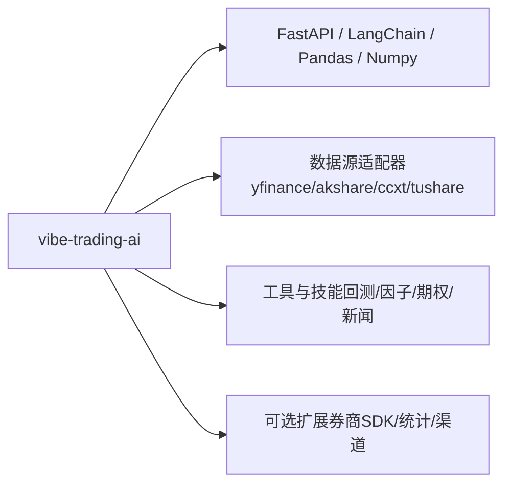

# 项目介绍与目标

<cite>
**本文引用的文件**
- [README.md](file://README.md)
- [README_zh.md](file://README_zh.md)
- [SKILL.md](file://agent/SKILL.md)
- [pyproject.toml](file://pyproject.toml)
</cite>

## 目录
1. [简介](#简介)
2. [项目结构](#项目结构)
3. [核心组件](#核心组件)
4. [架构总览](#架构总览)
5. [详细组件分析](#详细组件分析)
6. [依赖分析](#依赖分析)
7. [性能考虑](#性能考虑)
8. [故障排查指南](#故障排查指南)
9. [结论](#结论)
10. [附录](#附录)

## 简介
Vibe-Trading 是一个以自然语言为入口的量化研究与交易平台。它将“自然语言金融研究、AI 驱动工作流、多市场回测与企业级安全”融为一体，目标是降低量化交易的门槛、提升研究效率、实现从想法到回测再到执行的自动化闭环。平台面向个人投资者、量化研究员与金融机构，提供跨市场数据接入、内置因子库、多智能体协作、影子账户诊断、以及可审计的安全边界，帮助不同背景的读者快速完成“提问—研究—验证—交付”的全流程。

项目的核心价值在于：
- 用自然语言即可发起研究任务，自动调度数据、因子、回测与报告生成。
- 覆盖 A 股、港股、美股、加拿大、印度、韩国、加密、期货、外汇等主流市场。
- 内置 50+ 专业工具与 88+ 技能，支持 18+ 免费数据源与可选付费数据通道。
- 提供 12 个券商连接器（含只读与模拟/实盘有界执行），保障实盘安全与合规。
- 通过沙箱、审计账本、最小权限与强制校验，构建企业级安全基线。

适用场景举例：
- 个人投资者：用一句话完成策略构思、历史回测与风险透视。
- 量化研究员：批量评估 Alpha Zoo 因子、进行横截面分析与归因。
- 金融机构：在严格约束下开展研究、审计与合规留痕，并对接外部系统。

**章节来源**
- [README.md:1-182](file://README.md#L1-L182)
- [README_zh.md:207-598](file://README_zh.md#L207-L598)
- [SKILL.md:24-133](file://agent/SKILL.md#L24-L133)

## 项目结构
仓库采用前后端分离与模块化设计：
- 后端核心位于 agent/src，包含代理循环、API 路由、会话管理、记忆、工具注册、回测引擎、数据加载器、频道集成与安全模块。
- CLI 与 MCP 服务分别提供交互式终端与机器间工具调用接口。
- 前端使用 React + Vite，提供 Web UI、图表与运行详情。
- 桌面端 Electron 封装后端生命周期与本地安全存储。
- Wiki 文档与教程提供入门与进阶内容。

**图示来源**
- [pyproject.toml:77-87](file://pyproject.toml#L77-L87)
- [SKILL.md:24-56](file://agent/SKILL.md#L24-L56)

**章节来源**
- [pyproject.toml:77-87](file://pyproject.toml#L77-L87)
- [SKILL.md:24-56](file://agent/SKILL.md#L24-L56)

## 核心组件
- 智能体与工具层：将研究任务拆解为可执行的工具调用，如获取行情、因子分析、回测、期权定价、新闻与研报读取、交易日志分析等。
- 数据层：统一的数据加载器注册表，按市场类型选择公开源、可选 key 数据源或券商网关数据源，并在可用时做 fallback。
- 回测层：多市场引擎（A 股、全球股票、印度、韩国、加密、期货、外汇、组合与期权），内置指标、基准对比与优化器。
- 券商连接器：账户、持仓、委托、报价、历史 K 线与下单/撤单的抽象，支持只读与受约束的模拟/实盘执行。
- 安全与治理：沙箱、审计账本、最小权限、路径与网络守卫、认证与限流。
- 多智能体协作：预设团队（投资委员会、量化台、风控委员会等）进行复杂研究的并行推理与报告生成。
- 定时研究与交付：后台执行器按 cron/interval 触发任务，并通过 Web/API/MCP/IM 渠道交付结果。

**章节来源**
- [README_zh.md:338-443](file://README_zh.md#L338-L443)
- [SKILL.md:67-133](file://agent/SKILL.md#L67-L133)

## 架构总览
Vibe-Trading 的端到端流程如下：
- 用户通过 CLI/Web/MCP/IM 输入自然语言问题。
- 智能体解析意图，选择工具链（数据、因子、回测、报告）。
- 数据加载器按市场与可用性拉取 OHLCV/基本面/事件数据。
- 回测引擎按市场规则模拟交易，输出指标与风险透视。
- 结果通过 Web/UI、API、MCP、IM 渠道呈现，并可归档为可复现实验工件。

**图示来源**
- [SKILL.md:67-133](file://agent/SKILL.md#L67-L133)
- [README_zh.md:338-443](file://README_zh.md#L338-L443)

## 详细组件分析

### 数据与回测能力
- 数据源覆盖广泛：A 股、港股、美股、加拿大、印度、韩国、加密、期货、外汇；默认 18+ 免费源，可选 QVeris 付费通道。
- 回测引擎丰富：9 个市场引擎 + 组合引擎，内置指标、基准对比、优化器与验证方法（蒙特卡洛、Bootstrap、Walk-Forward）。
- 因子库齐全：Alpha Zoo 包含 qlib158、alpha101、gtja191、academic、fundamental 五大 zoo，支持一键横评与对比。

**图示来源**
- [README_zh.md:338-443](file://README_zh.md#L338-L443)
- [SKILL.md:76-119](file://agent/SKILL.md#L76-L119)

**章节来源**
- [README_zh.md:338-443](file://README_zh.md#L338-L443)
- [SKILL.md:76-119](file://agent/SKILL.md#L76-L119)

### 多智能体协作与定时研究
- 多智能体团队：预设 30 支团队（投资委员会、量化台、风控委员会等），支持并行推理、状态卡片与持久化报告。
- 定时研究：后台执行器按 interval/cron 触发任务，支持时区感知与失败重试，结果通过 Web/API/MCP/IM 交付。

**图示来源**
- [SKILL.md:98-109](file://agent/SKILL.md#L98-L109)
- [README_zh.md:121-133](file://README_zh.md#L121-L133)

**章节来源**
- [SKILL.md:98-109](file://agent/SKILL.md#L98-L109)
- [README_zh.md:121-133](file://README_zh.md#L121-L133)

### 安全与合规
- 沙箱与最小权限：生成的策略代码无法访问敏感系统调用，子进程继承白名单环境变量。
- 审计与可追溯：每次运行写入哈希清单，审计账本哈希链式串联，篡改可检测。
- 认证与限流：关键接口启用认证与速率限制，远程访问需显式配置。
- 数据与网络守卫：媒体下载拒绝内网/非全局地址，MCP 传输与工具调用具备超时与错误收敛。

**图示来源**
- [README_zh.md:93-120](file://README_zh.md#L93-L120)
- [SKILL.md:54-64](file://agent/SKILL.md#L54-L64)

**章节来源**
- [README_zh.md:93-120](file://README_zh.md#L93-L120)
- [SKILL.md:54-64](file://agent/SKILL.md#L54-L64)

## 依赖分析
- 包名与命令：PyPI 包名为 vibe-trading-ai，安装后提供 CLI、Web 服务与 MCP 服务。
- 运行时要求：Python 3.11–3.13，核心依赖包括 FastAPI、LangChain/LangGraph、pandas、numpy、ccxt、akshare、yfinance、tushare 等。
- 可选扩展：券商 SDK（IBKR、Longbridge、MT5）、统计建模（statsmodels/arch）、渠道适配（Telegram、Slack、飞书等）。

**图示来源**
- [pyproject.toml:1-27](file://pyproject.toml#L1-L27)
- [pyproject.toml:24-69](file://pyproject.toml#L24-L69)
- [pyproject.toml:105-223](file://pyproject.toml#L105-L223)

**章节来源**
- [pyproject.toml:1-27](file://pyproject.toml#L1-L27)
- [pyproject.toml:24-69](file://pyproject.toml#L24-L69)
- [pyproject.toml:105-223](file://pyproject.toml#L105-L223)

## 性能考虑
- 数据缓存：可选本地缓存避免重复下载与限速，批量与连接型 loader 在缓存命中时跳过网络。
- 向量化与加速：滚动因子热路径使用 bottleneck/NumPy 快路径，信号对齐向量化提升吞吐。
- 资源隔离：子进程继承白名单环境变量，减少内存与 CPU 占用；长任务心跳与优雅取消改善交互体验。
- 可扩展性：MCP 与 IM 渠道支持异步与流式传输，便于横向扩展与高并发场景。

[本节为通用指导，不直接分析具体文件]

## 故障排查指南
- 启动与鉴权：远程部署需设置 API 密钥；本地开发建议使用 localhost 以避免跨站限制。
- Provider 可靠性：若出现模型空响应或流式中断，可使用 provider doctor 查看脱敏快照并定位环境侧问题。
- 数据源降级：部分行情结果会通过 fallback 链补齐缺失标的，补不齐则快速失败，避免静默缩小回测范围。
- 工具超时与错误收敛：长耗时工具具备心跳与阶段进度，超时返回规范化错误而非挂起。

**章节来源**
- [README_zh.md:141-148](file://README_zh.md#L141-L148)
- [README_zh.md:78-92](file://README_zh.md#L78-L92)

## 结论
Vibe-Trading 以自然语言为入口，打通“研究—验证—交付”的闭环，覆盖多市场数据、因子库、回测引擎与券商连接器，并提供企业级安全与审计能力。其独特价值体现在：
- 低门槛：无需深厚编程背景即可发起研究任务。
- 高效率：内置 50+ 工具与 88+ 技能，结合多智能体协作与定时研究。
- 广覆盖：18+ 数据源与 12 个券商连接器，支持跨市场组合研究。
- 强安全：沙箱、审计账本、最小权限与认证限流，满足机构合规需求。

无论个人投资者、量化研究员还是金融机构，都能借助该平台快速完成从想法到可复现实验与报告的完整流程。

[本节为总结性内容，不直接分析具体文件]

## 附录
- 快速上手：安装后即可使用回测、数据获取、因子分析、期权定价、交易日志分析与影子账户等功能，零 API Key 即可覆盖多数市场。
- 扩展能力：通过 MCP 接入外部工具与服务，或通过可选扩展安装券商 SDK、统计建模与 IM 渠道适配。
- 文档与教程：Wiki 提供入门教程、研究实验室与 Alpha Library，帮助不同背景读者理解与使用。

**章节来源**
- [SKILL.md:201-207](file://agent/SKILL.md#L201-L207)
- [README_zh.md:592-598](file://README_zh.md#L592-L598)