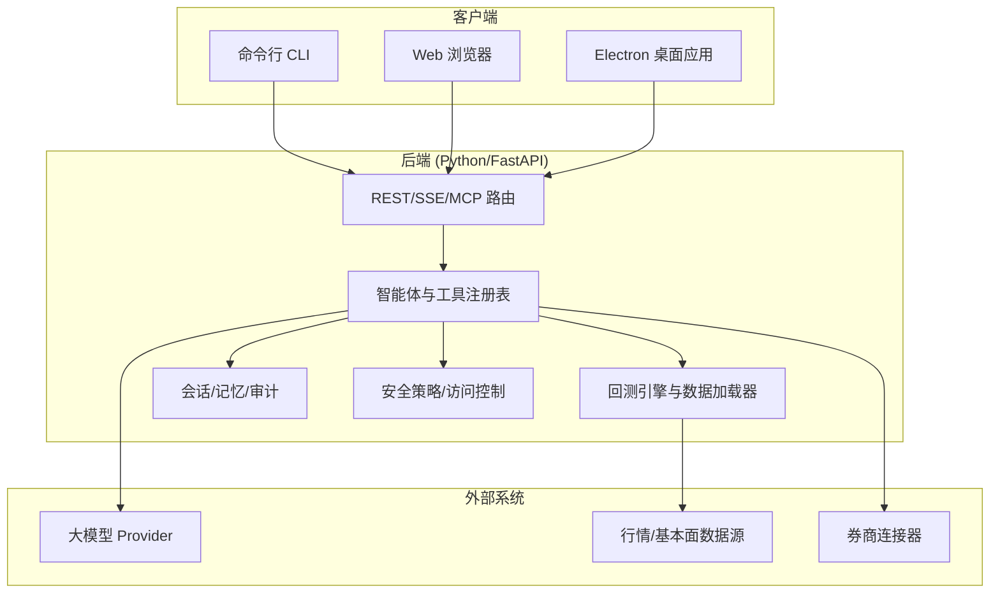
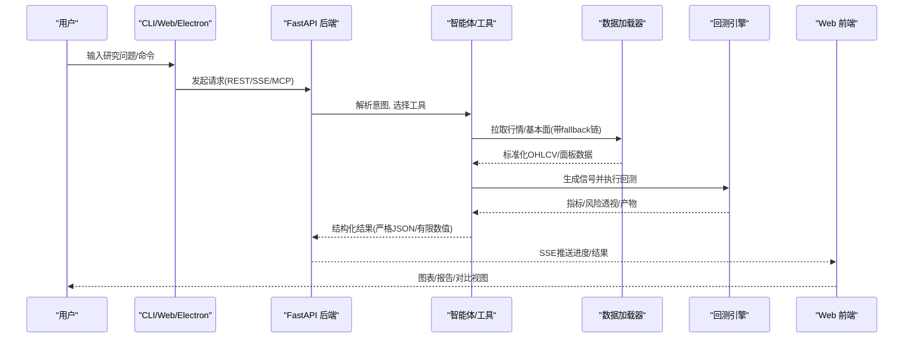
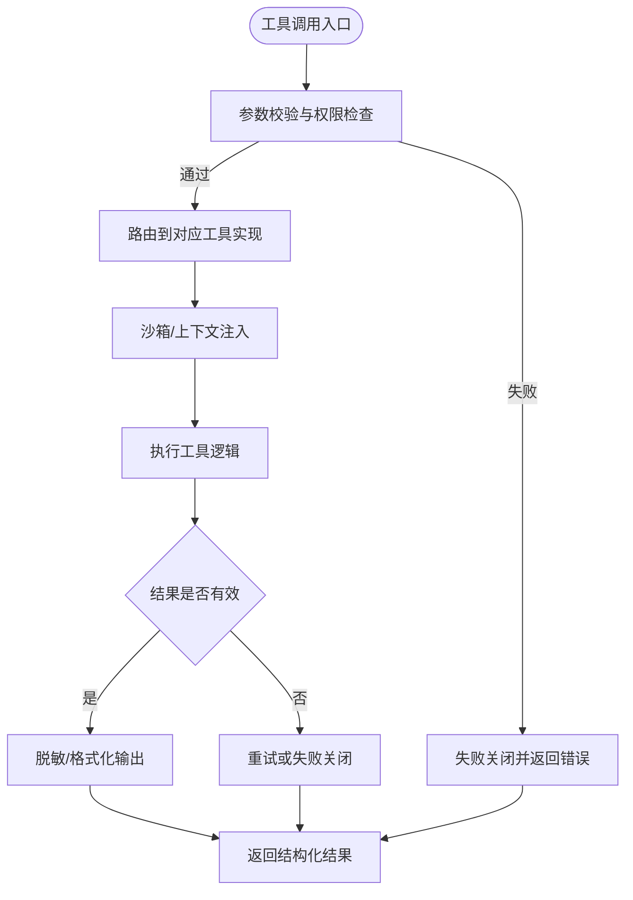
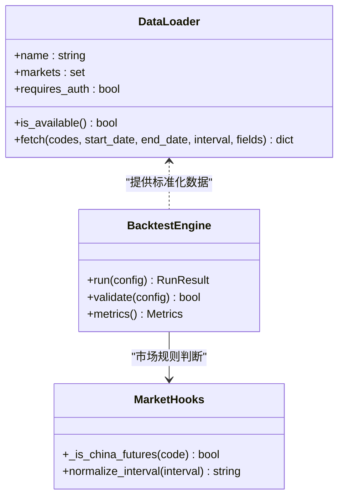
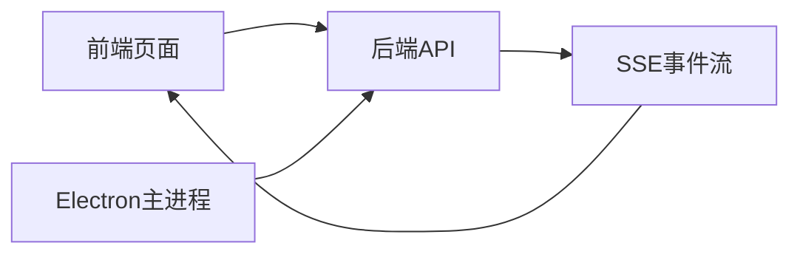
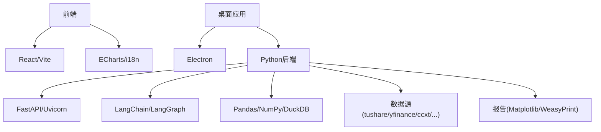

# 项目概述

<cite>
**本文引用的文件**
- [README.md](file://README.md)
- [README_zh.md](file://README_zh.md)
- [pyproject.toml](file://pyproject.toml)
- [agent/requirements.txt](file://agent/requirements.txt)
- [frontend/package.json](file://frontend/package.json)
- [desktop/electron/package.json](file://desktop/electron/package.json)
- [agent/src/api/swarm_routes.py](file://agent/src/api/swarm_routes.py)
- [wiki/tutorials/vibe-trading-beginner-zh.html](file://wiki/tutorials/vibe-trading-beginner-zh.html)
</cite>

## 目录
1. [简介](#简介)
2. [项目结构](#项目结构)
3. [核心组件](#核心组件)
4. [架构总览](#架构总览)
5. [详细组件分析](#详细组件分析)
6. [依赖关系分析](#依赖关系分析)
7. [性能考量](#性能考量)
8. [故障排查指南](#故障排查指南)
9. [结论](#结论)
10. [附录：快速开始与使用示例](#附录快速开始与使用示例)

## 简介
Vibe-Trading 是一个集自然语言金融研究、多市场回测、AI 驱动工作流与企业级安全于一体的量化交易平台。它通过智能体（Agent）将“用自然语言提出研究问题”到“自动获取数据、生成信号、执行回测、输出报告”的闭环打通，并支持股票、期货、加密货币、外汇等多资产类别。平台提供 CLI、Web UI、MCP 工具接口以及可选的 Electron 桌面应用，便于个人研究者与团队在本地或服务器环境中协作。

- 技术栈概览
  - Python + FastAPI 后端：提供 REST API、SSE 实时事件、MCP 服务、会话与运行管理。
  - React 前端：基于 Vite 构建，提供聊天、图表、Alpha 库、相关性面板等界面。
  - Electron 桌面应用：封装后端生命周期、凭据管理与跨平台打包。
- 资产类别
  - 股票（A 股、美股、港股、印度、韩国等）、期货（全球与中国）、加密货币、外汇。
- 能力规模
  - 50+ 专业工具（研究、数据、交易、因子、组合优化、归因等）。
  - 18+ 数据源（免费与可选 key 的数据提供商，含 fallback 链）。
  - 12 个交易连接器（券商直连与 MCP 接入，支持模拟盘与受控实盘下单）。

本节为概念性概述，不直接分析具体代码文件。

## 项目结构
仓库采用多包多模块组织：
- agent：Python 后端主体，包含 CLI、API、回测引擎、数据加载器、技能（skills）、工具（tools）、会话与记忆、安全策略、MCP 服务等。
- frontend：React + TypeScript 前端，使用 Vite、Tailwind、ECharts 等。
- desktop/electron：Electron 宿主，负责启动/守护后端、本地凭据存储与打包。
- wiki：文档与教程站点资源。
- 根目录：Docker、CI、依赖与发布配置。

**图示来源**
- [agent/src/api/swarm_routes.py:1-81](file://agent/src/api/swarm_routes.py#L1-L81)
- [pyproject.toml:1-80](file://pyproject.toml#L1-L80)
- [frontend/package.json:1-58](file://frontend/package.json#L1-L58)
- [desktop/electron/package.json:1-86](file://desktop/electron/package.json#L1-L86)

**章节来源**
- [pyproject.toml:1-80](file://pyproject.toml#L1-L80)
- [frontend/package.json:1-58](file://frontend/package.json#L1-L58)
- [desktop/electron/package.json:1-86](file://desktop/electron/package.json#L1-L86)

## 核心组件
- 智能体与工作流
  - 通过 CLI、REST、MCP 暴露工具调用；支持会话、目标（Goal）、Swarm 多智能体协作、定时研究与自动化流水线。
- 回测与数据层
  - 多市场引擎（股票、期货、加密、外汇、组合），统一数据加载器注册表与 fallback 链，内置 OHLC 完整性校验与复权处理。
- 工具与技能
  - 50+ 工具覆盖研究、数据读取、因子计算、组合优化、归因、期权分析、新闻与搜索等；技能（Skills）以可复用模块形式扩展能力。
- 安全与治理
  - 认证、限流、CORS/CSRF、沙箱化代码执行、审计账本、mandate 授权边界、kill switch、fail-closed 策略。
- 交付与集成
  - Web UI、CLI、MCP、IM 通道（Telegram、Slack、Discord 等）、OpenBB Workspace 桥接、导出至 Pine Script / vn.py / MT5。

**章节来源**
- [README_zh.md:61-135](file://README_zh.md#L61-L135)
- [README_zh.md:443-474](file://README_zh.md#L443-L474)

## 架构总览
下图展示了从用户输入到数据获取、智能体推理、回测执行与结果可视化的端到端流程。

**图示来源**
- [agent/src/api/swarm_routes.py:1-81](file://agent/src/api/swarm_routes.py#L1-L81)
- [README_zh.md:61-135](file://README_zh.md#L61-L135)

## 详细组件分析

### 智能体与工具生态
- 工具注册与发现
  - 工具通过注册表集中管理，CLI、REST、MCP 共享同一套工具集合，确保一致性与可维护性。
- 工作流编排
  - 支持单轮工具调用与多轮对话；Swarm 模式允许多智能体并行协作（如投资委员会、风控委员会），并通过状态卡实时展示各 worker 进展。
- 安全边界
  - 工具参数严格校验，失败关闭；敏感信息擦除；沙箱限制网络/子进程/不安全函数调用。

**图示来源**
- [README_zh.md:61-135](file://README_zh.md#L61-L135)

**章节来源**
- [README_zh.md:61-135](file://README_zh.md#L61-L135)

### 数据加载器与回测引擎
- 数据加载器
  - 统一注册表与 fallback 链，按市场分类（股票/期货/加密/外汇/宏观等），支持本地 CSV/Parquet/DuckDB 与多家第三方数据源。
  - 周期规范化（如 1h/4h/1d/1w），拒绝不支持周期并快速报错，避免静默降级。
- 回测引擎
  - 多市场引擎（GlobalEquity、ChinaFutures、Crypto、Forex、Options 等），内置成本、滑点、涨跌停、T+1/T+0、税费等规则。
  - 每次回测产出风险透视工件（集中度/波动率/回撤等），支持组合优化与归因分析。

**图示来源**
- [README_zh.md:443-474](file://README_zh.md#L443-L474)

**章节来源**
- [README_zh.md:443-474](file://README_zh.md#L443-L474)

### 前端与桌面应用
- 前端（React + Vite）
  - 提供聊天、图表、Alpha 库、相关性热力图、运行详情与对比视图；支持 i18n 与按需加载图表以提升首屏性能。
- 桌面应用（Electron）
  - 封装后端生命周期（随机端口、独立密钥、进程清理）、本地凭据安全存储（safeStorage）、多语言与打包脚本。

**图示来源**
- [frontend/package.json:1-58](file://frontend/package.json#L1-L58)
- [desktop/electron/package.json:1-86](file://desktop/electron/package.json#L1-L86)

**章节来源**
- [frontend/package.json:1-58](file://frontend/package.json#L1-L58)
- [desktop/electron/package.json:1-86](file://desktop/electron/package.json#L1-L86)

## 依赖关系分析
- Python 后端依赖
  - 框架与运行时：FastAPI、Uvicorn、Pydantic、WebSockets、SSE。
  - 智能体与编排：LangChain/LangGraph、LLM Providers（OpenAI兼容、Anthropic、DeepSeek、Kimi、ModelScope 等）。
  - 数据与计算：Pandas、NumPy、SciPy、DuckDB、Bottleneck。
  - 数据源：tushare、yfinance、akshare、ccxt、finnhub、alphavantage、tiingo、fmp 等。
  - 可视化与报告：Matplotlib、WeasyPrint、Jinja2。
- 前端依赖
  - React、TypeScript、Vite、Tailwind、ECharts、i18next、Zustand。
- 桌面依赖
  - Electron、electron-builder、TypeScript。

**图示来源**
- [pyproject.toml:24-69](file://pyproject.toml#L24-L69)
- [agent/requirements.txt:1-69](file://agent/requirements.txt#L1-L69)
- [frontend/package.json:17-56](file://frontend/package.json#L17-L56)
- [desktop/electron/package.json:24-29](file://desktop/electron/package.json#L24-L29)

**章节来源**
- [pyproject.toml:24-69](file://pyproject.toml#L24-L69)
- [agent/requirements.txt:1-69](file://agent/requirements.txt#L1-L69)
- [frontend/package.json:17-56](file://frontend/package.json#L17-L56)
- [desktop/electron/package.json:24-29](file://desktop/electron/package.json#L24-L29)

## 性能考量
- 数据层
  - 可选本地缓存（VIBE_TRADING_DATA_CACHE）减少重复下载与限流影响；批量 loader（yfinance/futu）在缓存命中时跳过连接。
  - 周期规范化与 OHLC 完整性校验避免无效计算与错误回测。
- 计算层
  - 滚动因子热路径使用 bottleneck/NumPy 快路径；alpha bench 进程并行避免重复传输大数据。
- 前端
  - 图表按需加载（summary/chart_symbol），首屏更快；懒加载与压缩降低初始包体积。
- 后端
  - SSE 心跳与超时控制提升长任务体验；严格 JSON 与有限数值保证序列化稳定。

[本节为通用性能建议，不直接分析具体代码文件]

## 故障排查指南
- 常见问题定位
  - 数据源不可用：检查 fallback 链与网络代理；查看日志中的 loader 名称与区间映射。
  - 周期异常：确认小写别名（1h/4h/1d/1w）与不支持周期的快速报错提示。
  - 工具超时/卡死：关注 SSE 心跳与工具阶段进度；必要时重启会话或禁用 shell 工具。
  - 认证与跨站：远程部署需设置 API_AUTH_KEY；本地开发注意 CORS/CSRF 默认行为。
- 诊断命令
  - 使用 provider doctor 打印脱敏环境快照；检查 sessions/runs 目录与缓存位置。
  - 通过 /health 与 /correlation/regime 等端点验证服务状态。

**章节来源**
- [README_zh.md:61-135](file://README_zh.md#L61-L135)

## 结论
Vibe-Trading 以智能体为核心，将自然语言研究、多市场回测、企业级安全与多端交付整合为一体。其模块化架构（数据加载器、回测引擎、工具与技能、前后端与桌面壳）使得扩展新市场、新数据源与新工具变得简单可控。对于初学者，可通过 CLI 与 Web UI 快速上手；对于有经验的开发者，可通过 MCP、API 与源码扩展能力，满足机构级研究需求。

[本节为总结性内容，不直接分析具体代码文件]

## 附录：快速开始与使用示例
- 安装要求
  - Python 3.11–3.13；Node.js >= 22（前端）；可选 Electron 用于桌面应用。
  - 推荐通过 pip 安装：pip install vibe-trading-ai。
- 基本步骤
  - 初始化环境：vibe-trading init（创建 .env 与基础配置）。
  - 启动后端：vibe-trading serve 或通过 Docker Compose。
  - 打开 Web UI：localhost 访问，或在 Settings 中配置 LLM 与数据源凭据。
  - 运行研究：vibe-trading run -p "描述你的研究问题"。
- 示例
  - 回测入门：vibe-trading run -p "对宽基股票指数进行动量策略回测，包含基准对比、最大回撤、换手率与简要解释"。
  - 数据源选择：公开行情源适合入门；可选 key 数据源提供更稳定字段；本地数据适合离线与可复现实验；组合市场可用 CompositeEngine。
  - 券商连接器：connector list/use/check 管理账户与权限；paper/live 由连接器属性决定。

**章节来源**
- [README_zh.md:61-135](file://README_zh.md#L61-L135)
- [wiki/tutorials/vibe-trading-beginner-zh.html:606-643](file://wiki/tutorials/vibe-trading-beginner-zh.html#L606-L643)